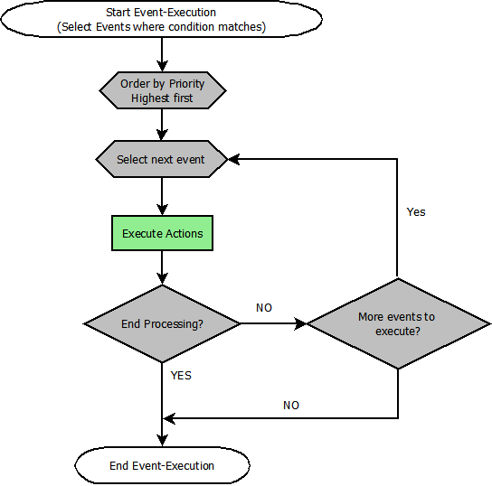

# Event Execution Order

<figure><figcaption><p>Event execution</p></figcaption></figure>

End Processing comes into account only if you have more than one event that would be executed, but want to stop processing after a certain event was processed.

This is more or less only handy for the BIP.\
Lets assume you have 2 events configured for a BIP plate:

```
a) Condition: VALUE equals 0 
   Action: turn plate OFF
   Priority: 1
   End Processing: OFF

b) Condition: VALUE less than 10 
   Action: turn plate RED
   Priority: 0
   End Processing: OFF
```

Now, if VALUE is _5_ , all is fine, only b) will be executed, as only the condition `VALUE < 10` matches and the plate turns red

Now, if VALUE is _0_ , you have a problem since first a) and then b) will be executed, as both conditions are true. This results in the plate turning red, where it should be off.\
If you set “End Processing” on a) to ON , b) will no longer be executed if a) already matched. So in this testcase the plate will be turned off, as expected.
