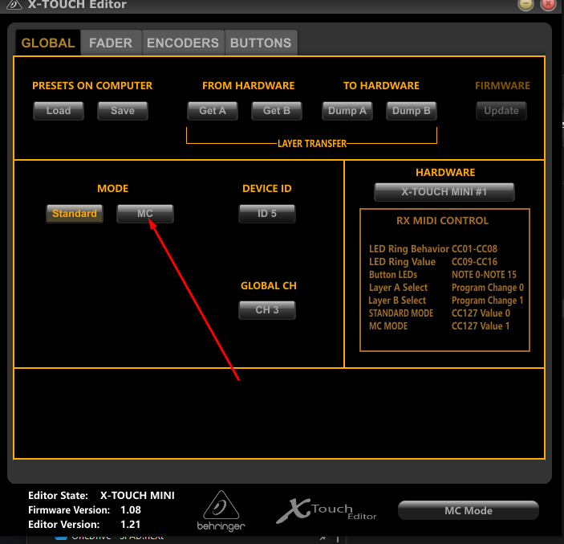

# Tuner Acceleration

Turning a tuner clockwise or counterclockwise can be modified so SPAD.neXt will accelerate changes in the sim \(Turning the tuner faster\)

Timeout: Time in milliseconds without any tuner-turn to reset the acceleration mutiplier 

Threshold: Number of tuner-movements into same direction before acceleration will be started 

Multiplier: The multiplier that will be applied to Increment/Decrement value for each stage when accelerated 

Max Multiplier: the maximum multiplier applied

With default values this means: 

if your turn the tuner clockwise like 5 clicks within 500ms with an increment value of "1" set following increments will sent to the sim: 

1. click: 1   
2. click: 1   
3. click: 1   
4. click: 3 \( Threshold met: \(clicks - threshold\)  _multiplier = \(4-3\)_  3\)  
5. click: 6 \( Threshold met: \(clicks - threshold\)  _multiplier = \(5-3\)_  3\)

Increasing timeout =&gt; Acceleration will be active for a longer time \(you can tunr the tuner slower\) Decrease timeout =&gt; You will need to turn the tuner really fast, but be aware wacky saitek hardware eats a lot of the \(counter-\)clockwise clicks even that you can feel it.

Increase threshold: Acceleration will start later   
Decreate threshold: Acceleration will start earlier, but might make it harder to achieve one/two-click changes

