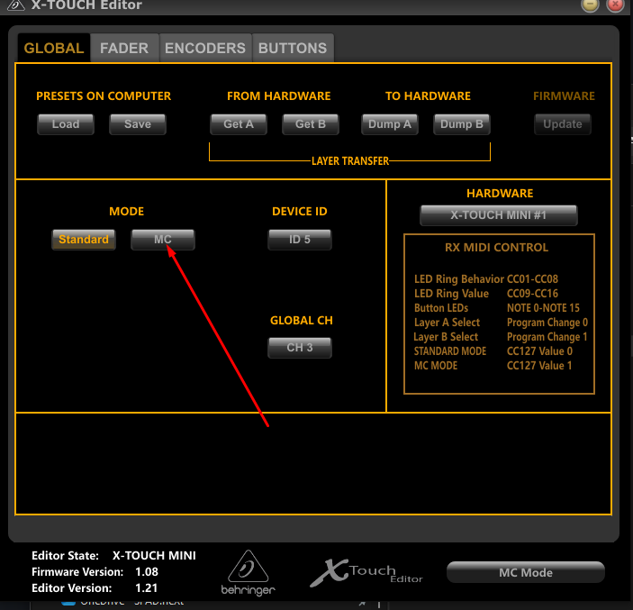

# SPAD.neXt discord community

Since there is no longer a forum for asking general question or getting a helping hand, there is a SPAD.neXt community discord for this purpose.

After the [Video-Guides](/broken/pages/aYClQrytxtoIoRs8EpSv) , the discord is the first stop ressource for any questions or problems.


Please note: The SPAD:neXt discord community is not a service run or maintained by SPAD.neXt. It's a seperate (free) product, which is used as tool.


## Joining the Discord Community

To join the SPAD.next Discord community follow this [li](https://discord.gg/spadnext)[nk](https://discord.gg/spadnext)

Please note that most of the channels on the SPD.neXt Community Discord are only accessible by licensed users.  You will only see a very few channels, and the only channel you can write to is #trial-users.\
This is the channel where you can ask general questions and our community experts will take care of it.

## Community Guidelines

(WIP)

## Linking your License

* Exit SPAD.neXt
* open the SPAD.neXt Discord
* On top of the users list (right side) you will see the "SPAD.neXt Bot" \
  (If you do not see the users list open it up with the Memberlist icon right next to teh serach box upper right)\
  
* Right-Click it and select "Message" to open a direct conversation with the bot.png>)
* enter `!link YOURORDERID` as message to him (Replace YOURORDERID with your actual Order/LicenseID. This is **not** the activation code! It's a 8-12 digit number)
* You will receive an email from the bot with the final command to link your license. This is to ensure a valid email is tied to the license in case we ever need to contact you. (No other data than your email and name is stored by SPAD.neXt)
* Copy the command from the email (should be something like `!link YOURORDERID-XXXX`
* Enter it in the direct conversation with the bot. The bot will tell you if it was successful
* If sucessfull you should see all the registered-only channels in the SPAD.neXt discord now

## Why linking my license?

If you link your license on the community discord, you will

* Get access to all discord channels available for your license
* Be able to open support tickets from inside SPAD.neXt
* Get access to the latest beta versions of SPAD.neXt (if you are eligable (Complete edition license or invited)
* Get access to the top edge alpha versions of SPAD.neXt (invite only)
* Get in touch with all the other SPAD.neXt users to exchange experiences
