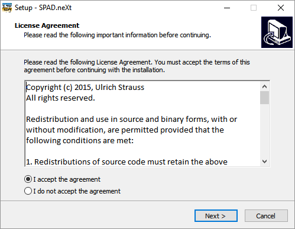
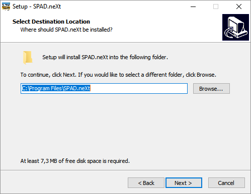

# Installation

After downloading the latest installer from the website \([https://www.spadnext.com/download/download-spad-next.html](https://www.spadnext.com/download/download-spad-next.html)\) extracting it, double-clicking the downloaded installation file "SPAD.neXt.Setup.exe" starts the installation. 

In case a security question pops up, confirm that the Publisher is "Ulrich Strauss" and click "Run".

Fig. 1 License agreement

Click on Next to accept the license conditions and continue the installation.

The following screen lets you choose the location of the installation.

Fig. 2 Install Location

For normal operation, it is recommended to install SPAD.neXt at the default location, however if you would like to install SPAD.neXt somewhere else, you can change the location here.

**Due to Windows security restrictions, do not install SPAD.neXt to the Root-Folder of your system drive \(e.g. C:\SPAD.neXt\)! The software will not be able to access its necessary files. If in doubt, just click next**.

For review the selected location will be shown. And clicking on next will start the download process, if necessary.

Fig. 3 Downloading installation files

After all files have been downloaded and installed the installation is complete

Fig. 4 Installation completed

and an Icon will be placed on your Desktop automatically.

