# Old-Getting-Started-Guide

Getting Started

Contents

[1. What is SPAD.neXt and will I need it? 3]()

[2. Requirements and features 5]()

[3. Where to get it and full vs. free vs. trial version 7]()

[4. Installation 8]()

[5. First Start: The Configuration Wizard 12]()

[6. A quick glance through the main interface 19]()

[7. Registration / Trial Key 21]()

[8. Profile selection, aircraft binding and takeoff 23]()

[9. Panels, Controls and FIPs 29]()

[10. Go flying! 34]()

[11. Simulator integration 36]()

[12. General Configuration Settings 38]()

[13. Working with profiles 42]()

[14. Once more on panels, controls, and fips - how to assign a button yourself 44]()

[15. Gauges, gauges, gauges 50]()

[16. SimConnect and networked configurations 53]()

[17. Where can I get further help? 58]()

[18. Author and Version 59]()

## What is SPAD.neXt and will I need it?

SPAD.neXt set out as a replacement for Saitek Flight Simulation Panels \([http://www.saitek.com/](http://www.saitek.com/)\) drivers, but supports much more Hardware today. While Saitek provides drivers for their panels, these have several shortcomings, notably lack of configurability. SPAD.neXt closes this gap and provides almost unlimited options to configure your panels not only for use with flight simulation software.

SPAD stands for Saitek Panels Advanced Driver. There was an earlier attempt to develop substitute drivers by Massimo de Nadal \([http://fstools.weebly.com](http://fstools.weebly.com/)\). Unfortunately, development stopped several years ago. Thus, Ulrich Strauss \([http://www.fsgs.com/](http://www.fsgs.com/)\) made a "neXt" approach. Despite similar names, SPAD.neXt is not based on the former SPAD drivers but has been written from scratch.

Saitek has been recently acquired by Logitech and all devices will be renamed. This guide uses the old common names for the devices.

SPAD.neXt had the reputation of being a bit hard to master initially. However, the latest versions enjoy a redesigned user interface as well as several helpful enhancements like online profiles and code snippets which should make it easier to come to terms.

This Guide is divided into two parts. **Part A** tries to give you a hand to get up into the air as soon as possible taking an A2A C172 and some basic Saitek hardware as examples. Essentially, these are the steps to get things going:

1. Download and install SPAD.neXt Sections 3, 4
2. Run the Configuration Wizard Section 5
3. Register SPAD.neXt \(optionally, for the registered version\) Section 7
4. Select and bind a proper profile for your plane Section 8
5. Select gauges for your Flight Instrument Panels, if you own any \(optionally, requires the registered version\) Section 9
6. Go flying! Section 10

**Part B** surveys a number of further features of SPAD.neXt which go beyond a first start, but should be helpful even for the average user to get the most out of SPAD.neXt.

Attention!

There are a few critical places were things tend to go South \(and were, possibly, the author of this guide failed before\). These are marked in red.

Registered only

SPAD.neXt comes in two flavors, a free one and a registered one \(cf. Section 3 for more detail\). Most of this guide is based on the assumption you are using the registered \(or trial\) version of SPAD.neXt. To avoid confusion, some aspects not working in the free version are marked in green.

**Part A : How to get into the air**

## Requirements and features

* Operating Systems: Windows 7, Windows 8 / 8.1, Windows 10 \(all 64 bit\)
* .Net Framework 4.5.1 or later \([https://www.microsoft.com/de-de/download/details.aspx?id=30653](https://www.microsoft.com/de-de/download/details.aspx?id=30653), pre-installed under Windows 10\)
* Supported Flight Simulators:
  * FS9
  * FS2000
  * FSX
  * FSX:SE
  * Prepar3D v2.3
  * Prepar3D v3
  * \(X-Plane\)
* Supported Simulation-Connection Methods:
  * Microsoft's SimConnect interface
  * Pete Dowson's FSUIPC, available from [http://www.schiratti.com/dowson.html](http://www.schiratti.com/dowson.html) \(freeware is sufficient\),
  * FSconnect \([http://www.dirks-software.ca/](http://www.dirks-software.ca/)\), for WILCO planes only.

SPAD.neXt supports the following devices/features as of the time of this writing:

* Saitek Switch Panel
* Saitek Multi Panel
* Saitek Radio Panel
* Saitek Backlit Information Panel

**Registered only** from here on

* Saitek Flight Information Panels
* Saitek Pro Flight Yoke
* Saitek Quadrant
* Saitek Trim Wheel
* Saitek Rudder Pedals
* SimConnect local/remote connection
* General Joysticks/Gamepads
* Access to LVARS \(e.g. for A2A aircraft\)
* Aircraft Profile-Database
* Code Snippets
* PMDG 737 NGX
* PMDG 777
* Aerosoft Airbus
* Wilco Airbus
* Ultimarc PACLED64/PACDRIVE \([http://www.ultimarc.com/pacled64.html](http://www.ultimarc.com/pacled64.html)\)
* Pololu Servo Controller \([https://www.pololu.com/category/12/rc-servo-controllers](https://www.pololu.com/category/12/rc-servo-controllers)\)
* Gauge-Market
* Send Keyboard-Keys to any program
* Keyboard macros
* Custom C\# Scripting for BIP etc. \( [https://github.com/c0nnex/SPAD.neXt/wiki](https://github.com/c0nnex/SPAD.neXt/wiki) \)

Attention!

As a general rule, it is not required that any Saitek drivers are installed on the system for SPAD.neXt to function correctly. However, there may be cases where you can't get Windows to properly detect some of your devices. In this case, there is no other way than installing the Saitek driver for the corresponding device. However, in any case stay off any Saitek additional "Software".

To make SPAD.neXt drive your Saitek Flight Instrument Panels \(FIP\) it is important to either disable or uninstall the Saitek DirectOutput Service.

## Where to get it and full vs. free vs. trial version

The most current installer of SPAD.neXt can always be found at [http://www.spadnext.com](http://www.spadnext.com/).

To enable the "registered only" features of SPAD.neXt, you will need to purchase an activation key turning the unregistered version into the registered one \(cf. Section 7\). This activation key is available from [SimMarket](https://secure.simmarket.com/spad.next.phtml). Just follow the link on the r.h.s. of the SPAD.neXt portal or the in-program link \(see again Section 7\).

In addition, there are a freeware and a trial version available. The freeware version has limited functionality \(essentially Radio/Switch/Multi/BIP only, no FIPs support, no networked configuration etc.\) while the trial version has full functionality, but runs for 5 days only turning to the freeware version afterwards.

A clever strategy might be to install the free version first, to see if you will be able to get it running and can master the interface. Next, you can activate the trial for 5 days to check if the additional features work. If you like it – you certainly will – you can buy a key for the full version either via SimMarket or directly from within SPAD.neXt later \(see section 7\).

In case of questions, you will find a very helpful and friendly user forum under [http://www.spadnext.com/forum/](http://www.spadnext.com/forum/). All announcements concerning SPAD.neXt will be done in this user forum. There is no mailing list.

Additional sources of information about SPAD.neXt are:

* YouTube Channel [https://www.youtube.com/channel/UCsgyEhnCPKZiTvXV2gBj5dA](https://www.youtube.com/channel/UCsgyEhnCPKZiTvXV2gBj5dA)
* Facebook [http://facebook.com/spad.next](http://facebook.com/spad.next)
* Discord: [https://discord.gg/sRwcWkB](https://discord.gg/sRwcWkB)
* Twitter: [https://www.twitter.com/spadnext](https://www.twitter.com/spadnext)

In case of issues, there are several ways to handle them, see Section 17.

## Installation

Please note, the SPAD.neXt Installer will always automatically download the most recent release from the webservers. A working internet connection is required for installation.

Double-clicking the downloaded installation file "SPAD.neXt.Setup.exe" starts the installation. In case a security question pops up, just confirm "Run".

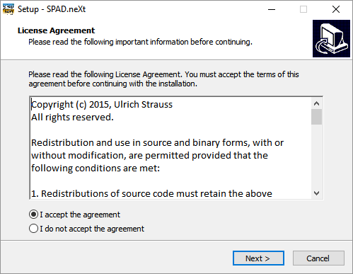

Fig. 1 License agreement

Click on Next to accept the license conditions and continue the installation.

The following screen lets you choose the location of the installation.

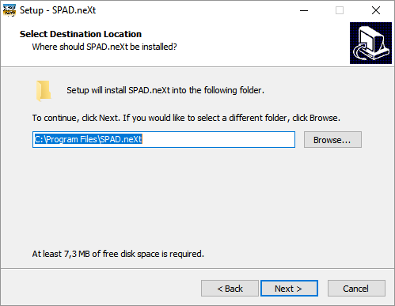

Fig. 2 Install Location

For normal operation, it is recommended to install SPAD.neXt at the default location, however if you would like to install SPAD.neXt somewhere else, you can change the location here.

Due to Windows security restrictions, do not install SPAD.neXt to the Root-Folder of your system drive \(e.g. C:\SPAD.neXt\)! The software will not be able to access its necessary files. If in doubt, just click next.

For review the selected location will be shown. And clicking on next will start the download process.

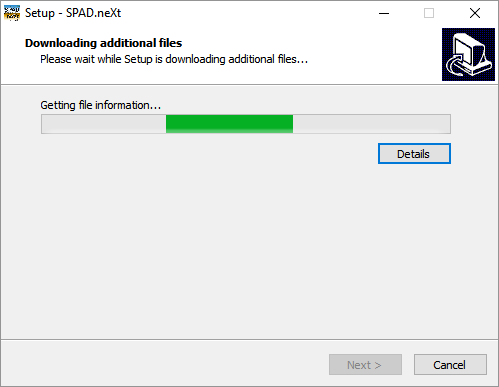

Fig. 3 Downloading installation files

After all files have been downloaded and installed the installation is complete

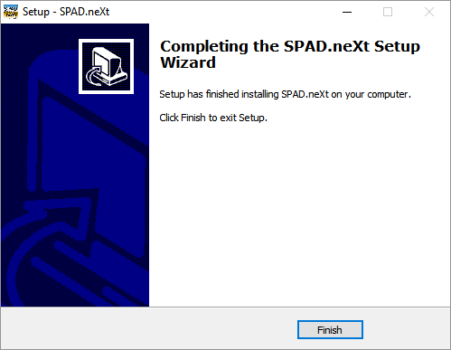

Fig. 4 Installation completed

and an Icon will be placed on your Desktop automatically.

## First Start: The Configuration Wizard

When starting SPAD.neXt the first time, you are offered a Configuration Wizard. While you can skip the wizard and either \(i\) configure SPAD.neXt manually, or \(ii\) call the Wizard at a later point of time, it is highly suggested to accept its help. All settings can be modified later within the program.

We will guide you through the various Wizard windows now.

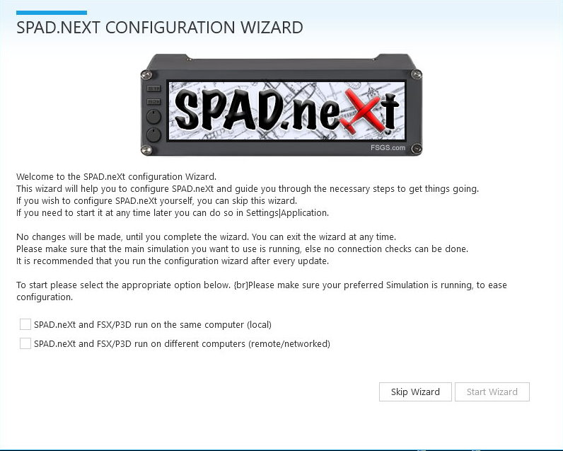

Fig. 5 Configuration Wizard: Welcome screen

**Local or Client-Server:** First, you have to select between a local or Client-Server installation. We assume a local installation \(i. e. SPAD.neXt running on the same machine as your simulator\) for now.

Registered only

Client-Server installations are dealt with in Section 16.

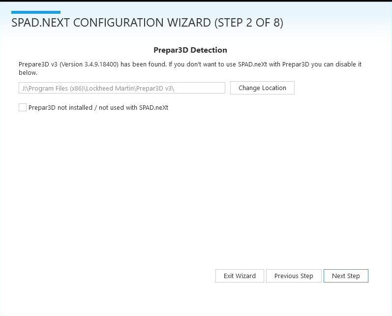

Fig. 6 Configuration Wizard: Simulator detection.

**Simulator Detection:** The next screen allows you to select the simulator you are going to use with SPAD.neXt. If the appropriate simulator is found, its path is given in the field, which can be changed, between, e. g., FSX boxed and FSX:SE. There will be two screens, one for FSX and another one for Prepar3d.

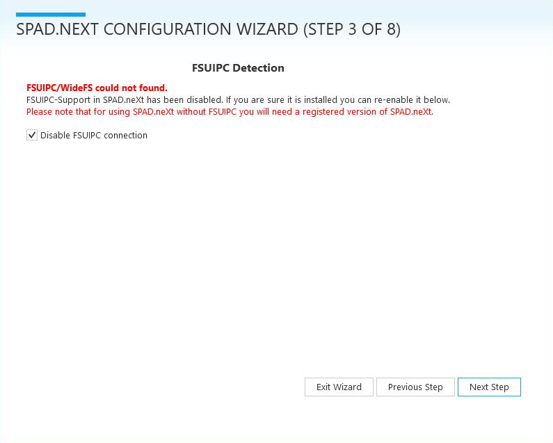

Fig. 7 Configuration Wizard: FSUIPC Detection

**FSUIPC Detection:** SPAD.neXt supports connection to the simulation via FSUIPC \(free version is sufficient\). It is suggested to leave this field disabled to save resources and use SimConnect \(see below\) unless you are common with FSUIPC.

You must enable this option in case you are going to use a Wilco plane.

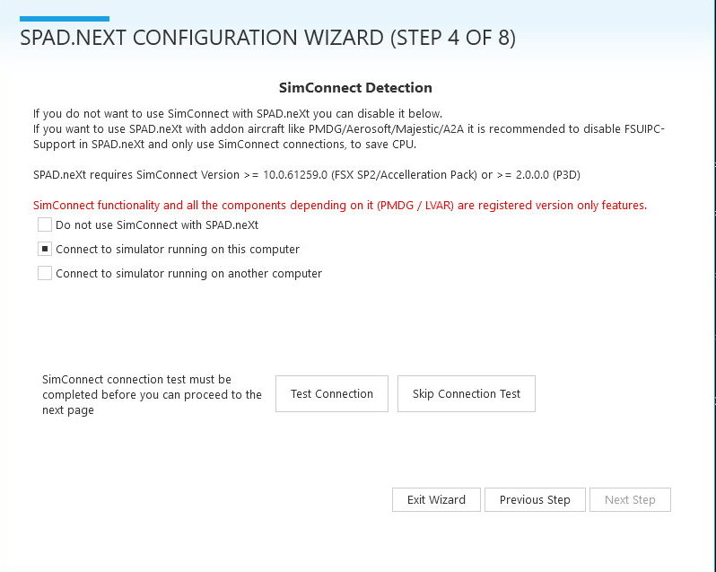

Fig. 8 Configuration Wizard: SimConnect Detection

**SimConnect Detection:** SPAD.neXt mainly communicates with the simulator via the SimConnect interface, thus the Wizard checks if a proper SimConnect version is installed. SimConnect is an interface developed by Microsoft to allow exchange of data between FSX \(and now Prepar3D\) and external programs running either on the same or on a networked computer. In case of trouble or if you are uncertain about SimConnect being installed, please refer to Section 16 for more detail.

Next, you have to select if the simulator is running on the same machine \(Server\) or on another one \(Client\). For "Test Connection" to work the simulator must be up and running on the respective machine, otherwise it will fail. The test returns version numbers of the simulator and SimConnect.

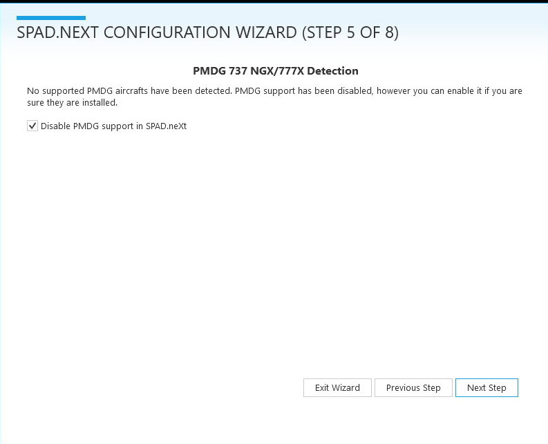

Fig. 9 Configuration Wizard: PMDG 737 NGX/777X Detection

**PMDG 737 NGX/777X Detection:** Determines if one of the PMDG planes is installed to be supported by SPAD.neXt. \(Registered only\)

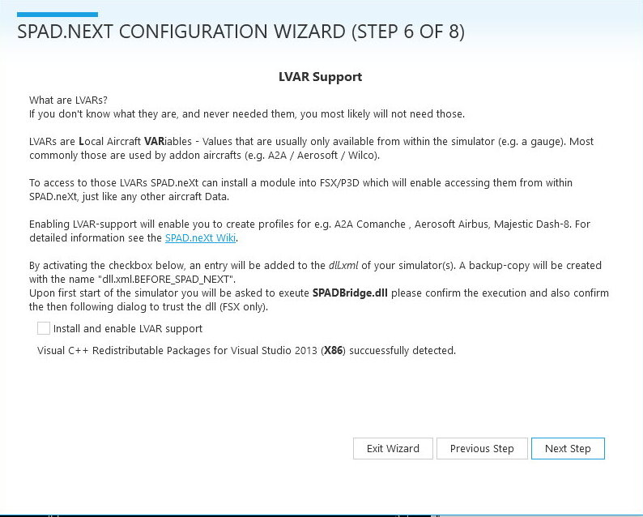

Fig. 10 Configuration Wizard: LVAR Support

**LVAR Support:** See the screen for more information what LVARs are. You should "Install and enable LVAR support" in case you use any addon aircraft like A2A, Aerosoft, Majestic Dash-8 Q400. In this case a specific module "SPDbridge.dll" will be installed into your simulator \(precisely into the dll.xml file\). Otherwise leave this unchecked. \(Registered only\)

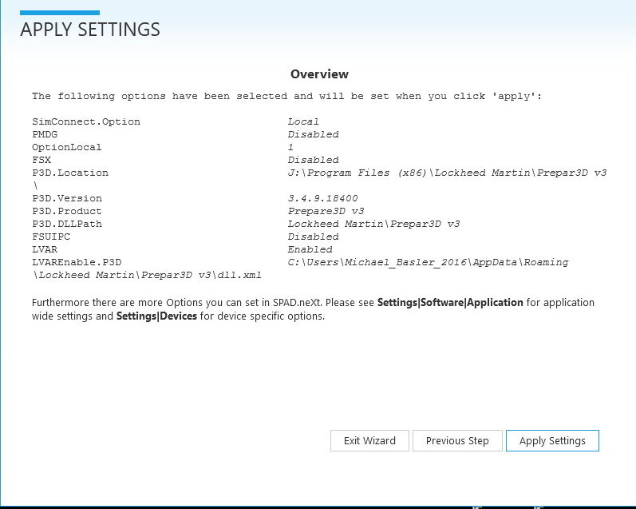

Fig. 11 Configuration Wizard: Overview

**Overview:** This screen gives a summary of the options selected. There has been no change made on your configuration or simulator so far. You can go back in case you want to revise them. Otherwise press "Apply Settings". The following screen just confirms that your options have been applied.

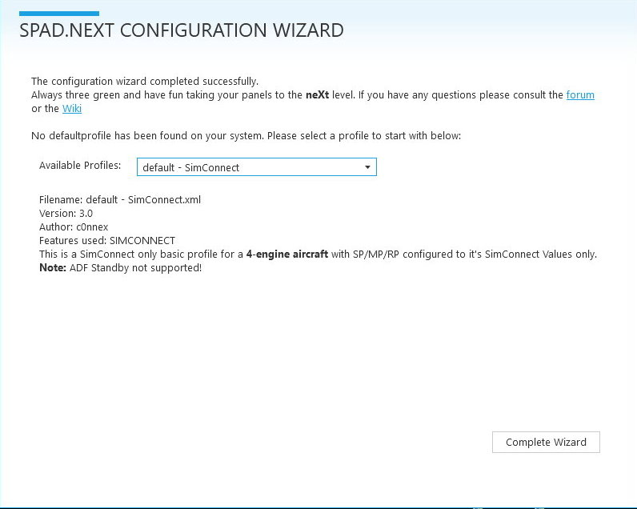

Fig. 12 Configuration Wizard: Final Step

The final selection concerns the profile selection. Profiles describe the relation between your Hardware \(i. e. Panels, FIPs, Controls\) and their functions. At this stage, just select "default - SimConnect" and "Complete Wizard". You will be given a possibility to select others profiles later.

## A quick glance through the main interface

Once you completed the Wizard, you will be greeted by a WELCOME screen \(Fig. 9\).

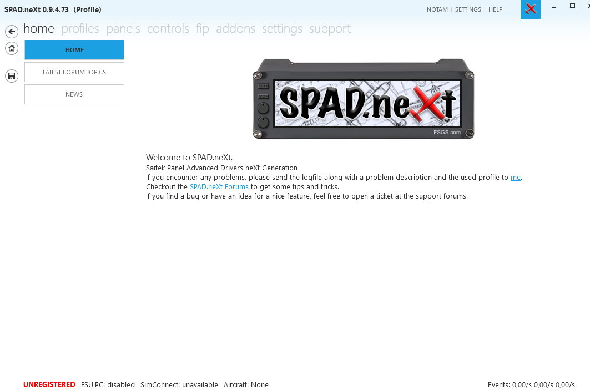

Fig. 13 The main interface: home

This will be your entry point every time you start SPAD.neXt. SPAD.neXt will check for possible updates at any restart. It is highly suggested to "Apply" any updates available. The updater runs in a separate window. After applying updates and clicking on "Close" at the bottom, SPAD.neXt has to be restarted.

There are some areas of the screen layout that will stay the same throughout the application:

1. Quick-Access buttons \(on the l.h.s., top to down\)

* **Back Icon**: will return to the page you are coming from, e.g. from settings directly back to the Switch Panel.
* **Home Icon**: will return to the WELCOME screen
* **Save Icon**: will save the active profile

1. Main-Menu \(on top\)
   * **home** this page
   * **profiles:** Specify the devices-functions-airplane connection
   * **panels:** Saitek Radio etc. panels, as far as installed and recognized by SPAD.neXt
   * **controls:** Yoke etc., as far as installed and recognized
   * **fips:** Saitek Flight Instrument Panels, as far as installed and recognized
   * **addons**: Special functions like data monitor and other advanced features
   * **settings**: Registration, Application Settings, and more
   * **support**: connection to the SPAD.neXt support ticket system
2. Sub-Menu \(left pane\)
   * Here you will see the menu-options available for the selected area in the main menu, e.g., the devices recognized on your system.
3. Status-Line \(at the bottom\)
   * Will show if you are using the unregistered \(free\) version vs. the registered one, the connection status of SimConnect and optionally FSUIPC as well as the currently loaded aircraft.

We will not go into detail with all the menu entries, as some of them go way beyond just "getting started". Instead, we will guide you now to get into the air as soon as possible.

##  Registration / Trial Key

The following description will be based on the registered version; we will mention some features not working in the free version in some places, though. If you don't own a registered copy yet, you either can apply for a 5-days trial key or buy a register code. You will have to go to the "settings" screen and select "REGISTRATION" from the submenu on the l.h.s. in both cases.

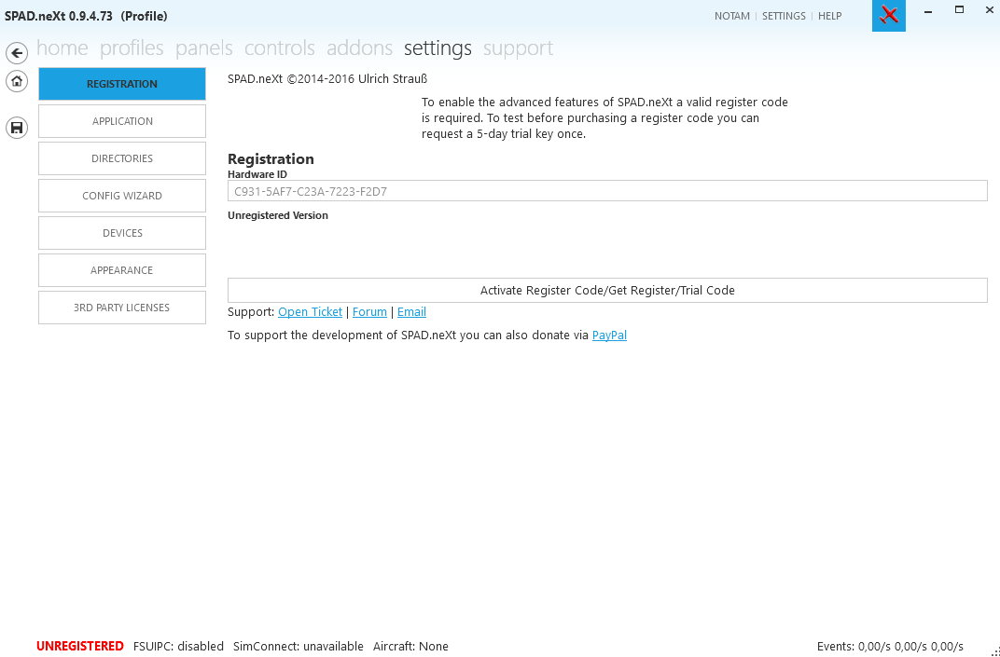

Fig. 14 The registration submenu

Press "Activate register Code/Get register/Trial Code". This opens the following activation window:

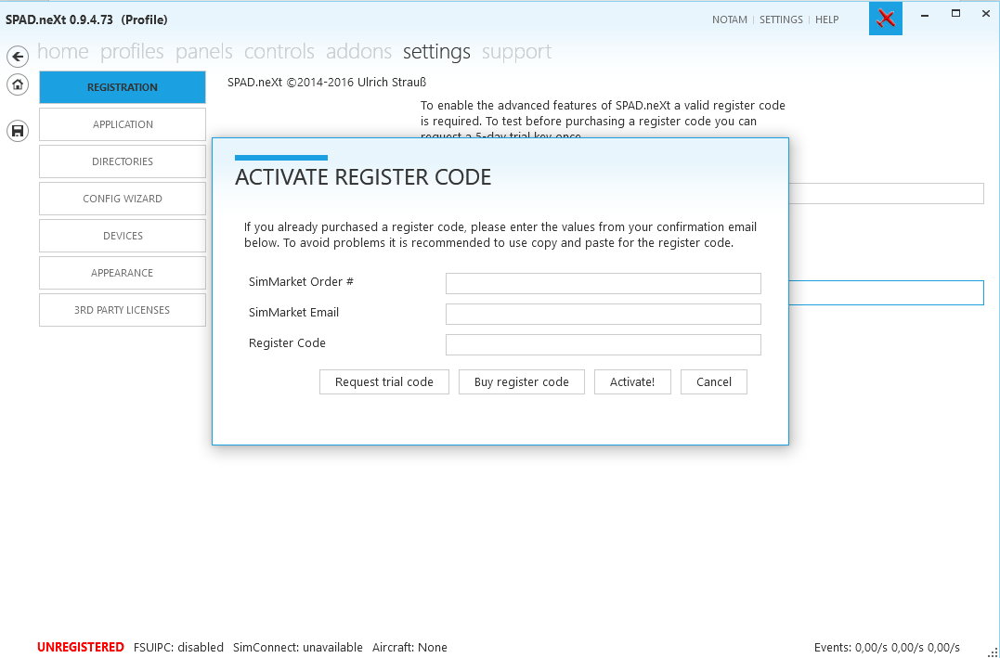

Fig. 15 Buying / Activation / Trial

There are three possibilities:

* If you didn't buy SPAD.neXt so far, you can press "Buy register code" which leads to SimMarket to buy it now.
* After buying from SimMarket you will get a confirmation email your registration code. Now you are ready to fill in your details \(order \#, mail and code\) and press "Activate".
* You can apply for a 5-days trial. Keep in mind this cannot be extended, thus plan in advance to have time for testing it.

The request for a trial code is granted immediately \(and anonymously, no details required\) and leads to the following result:

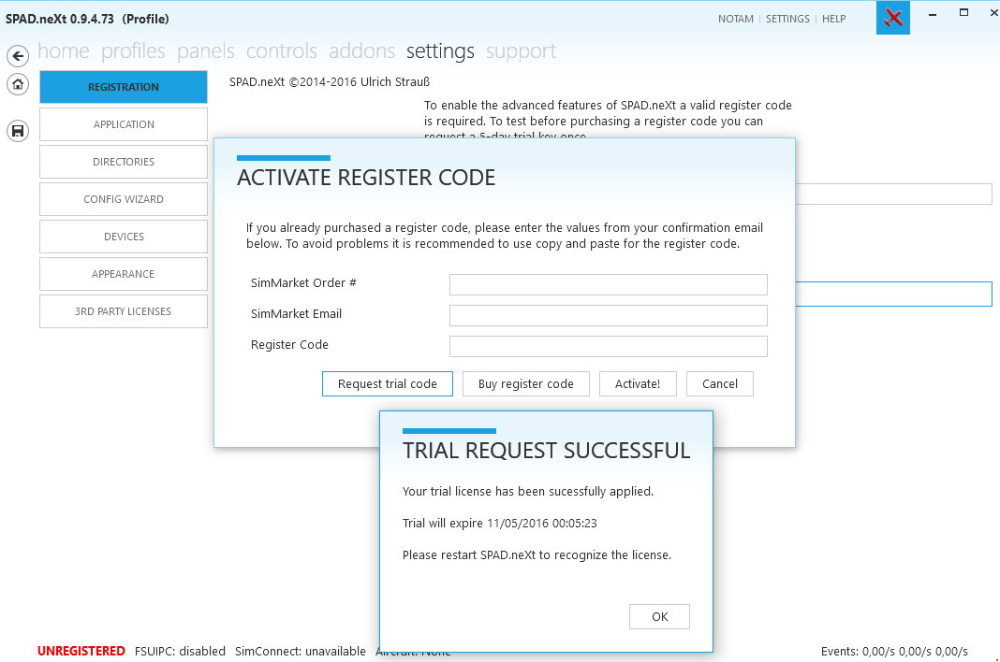

Fig. 16 Buying / Activation / Trial request

You can only request a 5-day trial key once per computer.

After inputting the registration details and restarting SPAD.neXt, the red "UNREGISTERED" in the Status Line should turn into a black "Registered".

## Profile selection, aircraft binding and takeoff

At this point we have to decide which aircraft we are going to fly first. It's certainly a good idea to begin with a simple GA plane like a Cessna C172 or C182. One of the more popular planes is the A2A Cessna 172, which we will take as an example. However, the following general guidelines can be followed to get SPAD.neXt to support any other plane, including even tube liners and choppers.

Registered only

A2A planes require LVAR support being limited to the registered version.

To proceed, we switch to the profiles menu entry.

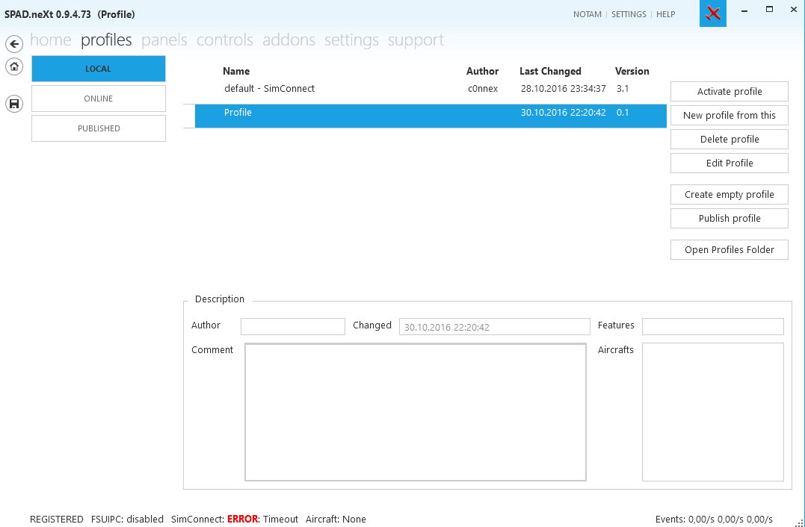

Fig. 17 The profiles menu

There are three panes. The middle one shows all locally installed profiles \("LOCAL"\). At present, there is only the one "default - Simconnect" which we choose when running the Wizard \(cf. Fig. 7\). Generally, you can build your profile \(i.e. the functions of all knobs, levers etc.\) from scratch, but this is a tedious process which moreover requires some knowledge of SimConnect variables.

Fortunately, a number of users as well as the author of SPAD.neXt have worked out and provided a number of working profiles already. You can use them "as is" or modify them according to your needs after getting a bit familiar with SPAD.neXt. To access these profiles \(being stored online\) press "ONLINE" on the left pane. Scrolling down provides a – quite impressive – list of all the online profiles available. Every profile is characterized by a unique name, its Author who submitted it, the Date of Submission and the Provider, i.e. the features required to get it working.

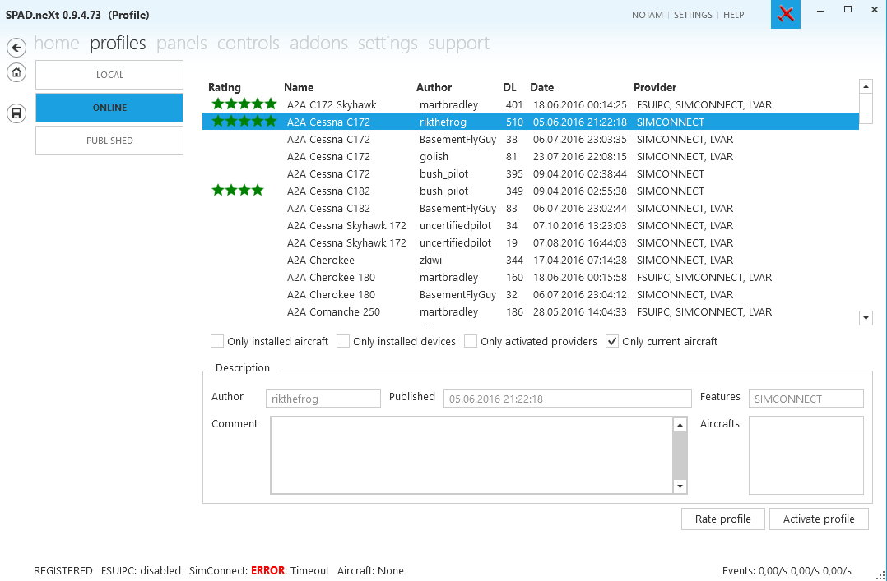

Fig. 18 Online profiles selection

At first glance this may be a bit overwhelming, thus here are some hints for selecting a specific profile:

* * 1. The leftmost column contains green stars as a result of user ratings. A five-star-rating should be a good indication the profile is at least working properly.
    2. The number of downloads may give another indication.
    3. Some \(unfortunately only a few\) profiles include Comments elucidating which functions are working and which don't or are limited in this profile.
    4. The SPAD.neXt website provides a [Profiles subforum](https://www.fsgs.com/forum/viewforum.php?f=21), where you will find discussions on several of the profiles submitted.

To see all online profile available, untick the checkbox next “Only current aircraft”, which will remove the filter to only show profiles for the current aircraft \(or profiles that have no aircraft set\).

Returning to the chosen A2A C172 we are in a quite comfortable situation in view of several choices. Now I put my former experience in and select the profile "A2A Cessna Skyhawk C172" submitted by "uncertifiedpilot" which I know to work at least basically. It includes a description with some of the special functions assigned.

To select it, put the blue bar upon the profile and press "Activate profile".

This results in the quick access disk icon on the l.h.s. to run red meaning there are unsaved changes. Press the icon to save your selection.

Attention!

Whenever the disk symbol is red there are unsaved changes in a profile which you should save to keep them for further use. Nothing will be saved automatically.

Changing to the LOCAL profiles the selected one should be in your list now.

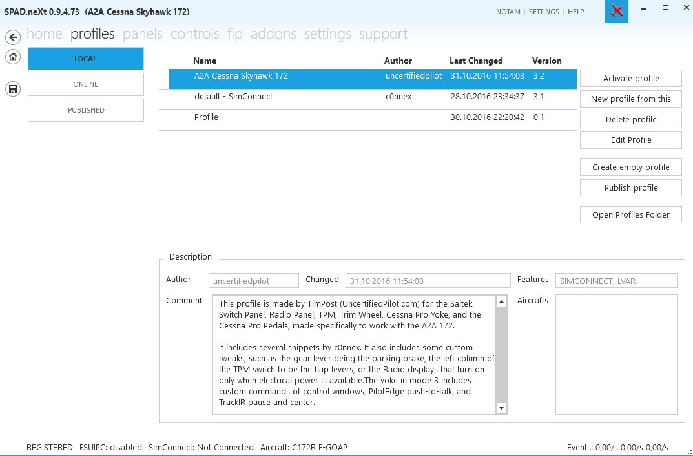

Fig. 19 The added A2A Cessna profile in the profiles list

There is a second potential trap. You might have selected a profile requiring a feature \("provider"\) which you did not activate during the Configuration Wizard run. In this case the profile will not be selected and you will get a corresponding error message. If you, e.g., did not activate LVAR support, which is required for our profile, you can go to SETTTINGS\|APPLICATION\|SIMULATIONS where you find switches for activating/deactivating these features in hindsight.

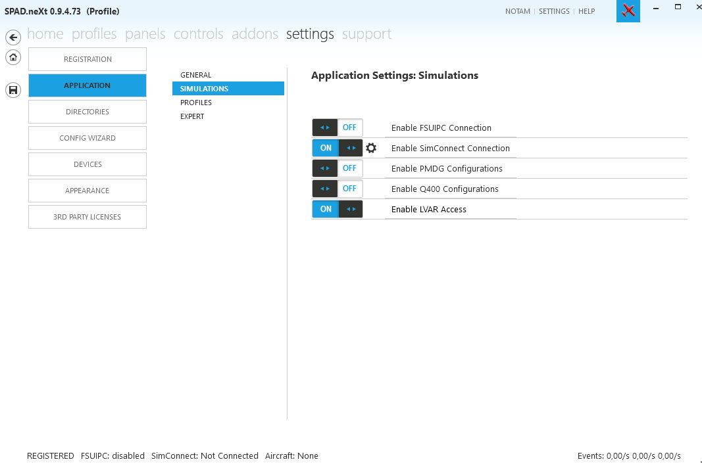

Fig. 20 Enabling/disabling features under Applications Settings

There is even a third potential trap. Who tells you your Hardware will fit to the profile being based on its author's Hardware? SPAD.neXt has a clever substitution mechanism pairing e.g. the Saitek Pro Flight Rudders Pedals with the Saitek Pro Flight Cessna Pedals. However, it certainly needs some hints in case the author used a yoke while you own a joystick. We assume your hardware is fitting for now and return to this case in Section X.

At this point we are not yet done, as we have to tell SPAD.neXt which aircraft\(s\) is/are going to make use of this profile. For this purpose, we select the profile via the blue line and press "Edit Profile" on the r.h.s. This opens a window for editing the profile.

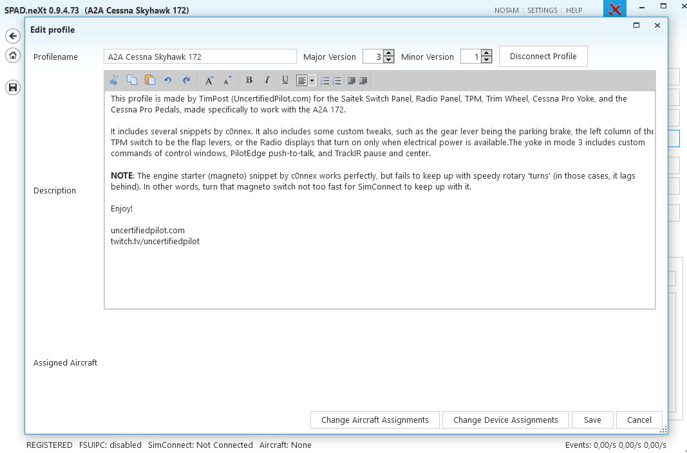

Fig. 21 Editing a profile

We are not going to edit the profile at this point, but choose "Change Aircraft Assignments" at the bottom.

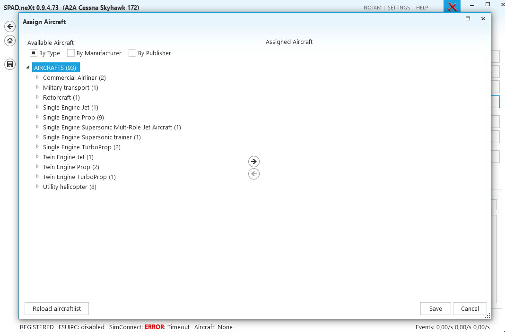

Fig. 22 Assigning an aircraft to a profile

The further procedure is quite straightforward.

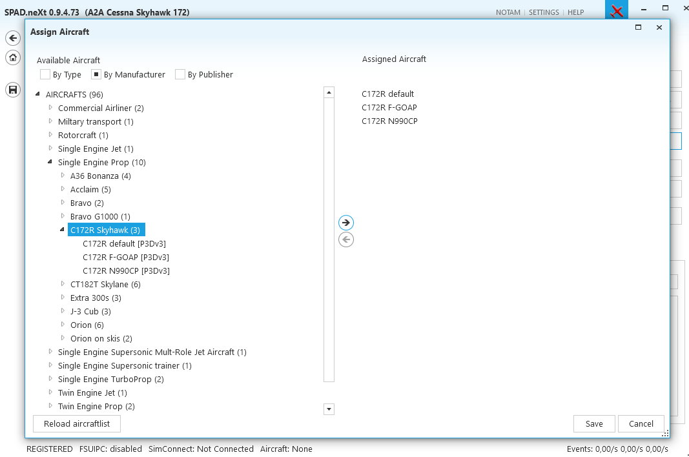

Fig. 23 Assignment of the A2A C172 to the profile "A2A Cessna Skyhawk 172"

After two times "Save" we are in the "profiles" menu again.

## Panels, Controls and FIPs

While we want to get into the air as soon as possible, we should at least take a short glance onto our assets. Select "panels" under the main menu and, depending which one\(s\) you own, one of the panels. The multi panel should look as follows:

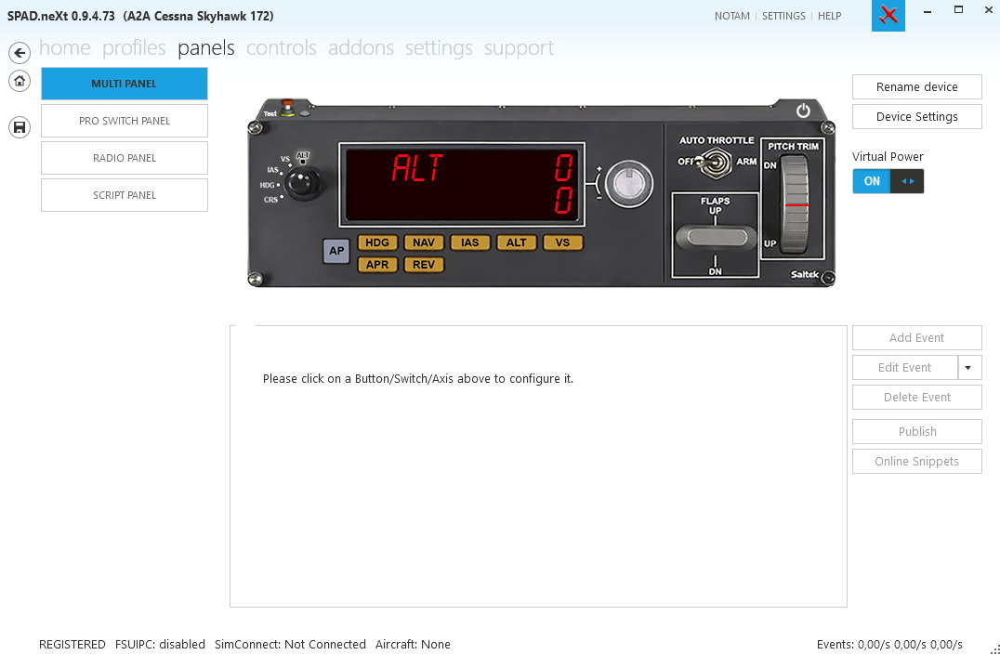

Fig. 24 The interface for the Saitek Multi Panel

You may want to press some of the autopilot buttons on the physical device to make sure the corresponding counterparts in SPAD.neXt will react properly \(e.g. being lit\). Actually, this screen provides a powerful interface for programming all sorts of functions, which, however, goes beyond just Getting Started.

Next, we switch to the "controls" main menu tab. Let's have a look upon the Saitek Cessna yoke as an example.

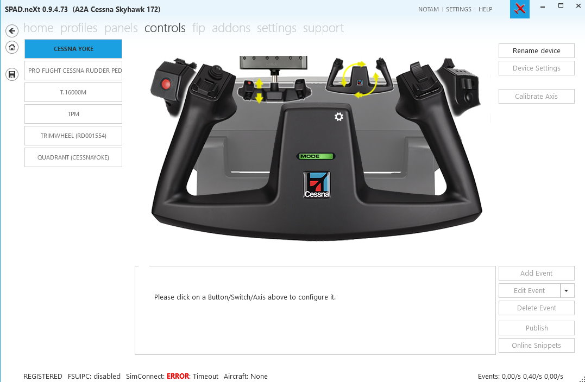

Fig. 25 The interface for the Saitek Cessna Yoke

Again, you should turn the Yoke a few degrees to make sure, the SPAD.neXt representation to react properly.

Registered only

Controls are only supported in the registered version.

The next main menu entry is devoted to "fip". We will assume you own at least one of the FIPs \(Saitek Flight Instrument Panel\), otherwise this menu entry is just missing.

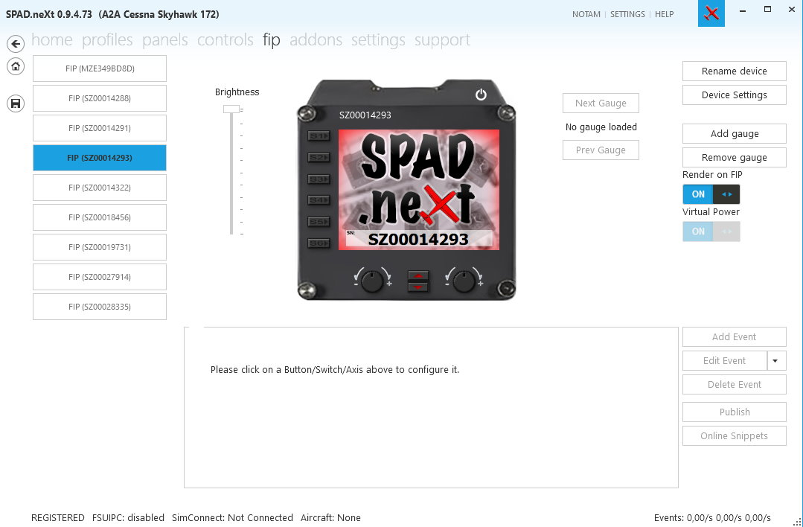

Fig. 26 One of the Saitek Flight Instrument Panels

If you own more than one of the FIPs they are listed in the column on the l.h.s. with their corresponding serial numbers. A similar image as above should be on the display of the physical FIP device. The serial number provides an easy correspondence between the physical device and the one displayed in SPAD.neXt.

Registered only

While FIPs are always displayed in SPAD.neXt, if connected, actual display of gauges on the physical device is only possible using the registered version.

Now that image isn't really helpful for piloting a plane, is it? You need gauges for making use of them. Again, we begin with a very simple solution relying on the Saitek gauges being included in SPAD.neXt for convenience. \(Recall: You MUST not have installed the Saitek FIPS software!\)

Click onto "Add gauge" on the r.h.s. to get to the gauge selection which should look like in Fig. 23.

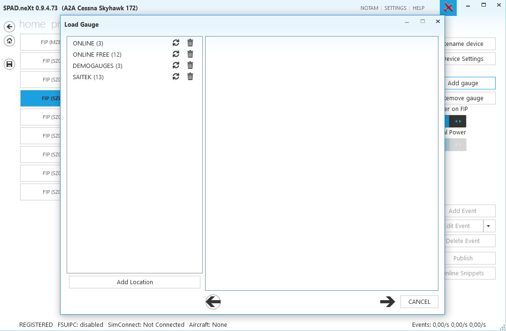

Fig. 27 Main gauge selection

Next, go to the SAITEK entry.

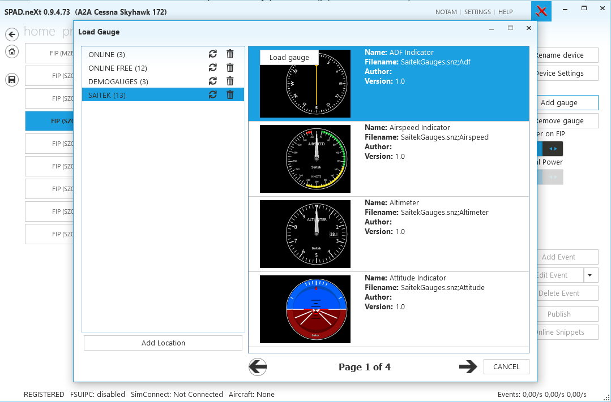

Fig. 28 Gauge selection

A natural choice for the first \(or only\) gauge is the Airspeed Indicator which can be activated just by double-clicking onto its image. Now your FIP should look like this one:

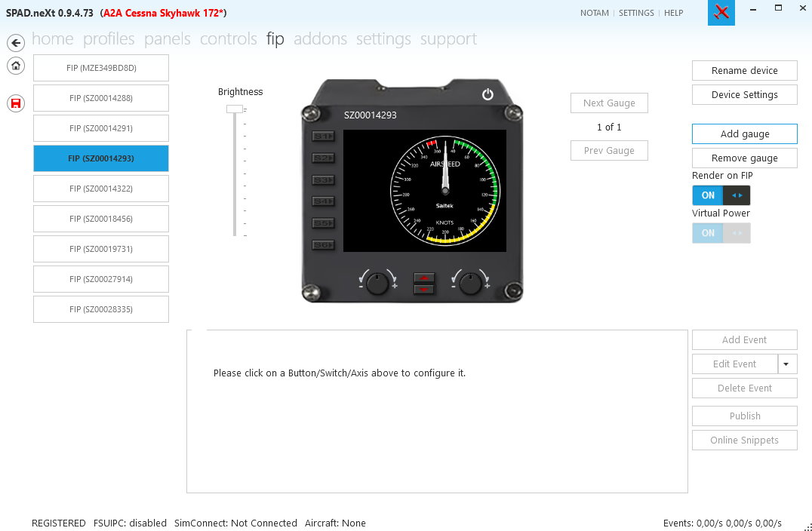

Fig. 29 FIP selection completed - the Saitek Airspeed gauge

You will see the red disk symbol close to the left border meaning you did not yet save your selection in the selected profile. Press it now, to have the gauge selection written to the profile.

Confirm that "Render on FIP" is set to "ON" which is the default setting. Now your physical FIP should display the Saitek Airspeed gauge. As understood, you can assign more gauges either to the same physical FIP \(switching between them with "Next Gauge" and "Previous gauge"\) or assign other gauges to others of your physical gauges in the same way.

## Go flying!

At this point you should be ready to go flying. Generally, SPAD.neXt can be started before, during or after the start of the simulator. I made it a habit to start it before the simulator providing a possibility to see if all the controls do their job. As always, there may be a little Gremlin introducing a loose connection between the yoke and the hub etc. No need to have the simulator running to catch him.

Don't forget to select the A2A C172 \(or whatever plane you selected the profile for\) in the Scenario Setup Screen. Otherwise, SPAD.neXt does not know which profile to use for the present plane and presents you a selection box \(which you are probably unable to handle at the present state\).

If all goes well, your C172 is ready to be started on the selected runway or ramp. You can even loose the parking brake using the gear lever - do you recall that assignment when reading the profile properties in Section 8? Given you own the proper hardware, all the basic functions like pitch, roll, throttle. etc. should work as assumed.

**Part B : A closer look upon helpful features**

## Simulator integration

As already mentioned in Section 10, SPAD.neXt can be started before, during or after the start of the simulator. To make SPAD.neXt run automatically whenever you start FSX/P3D you can make use of the EXE.XML file which can be found under

C:\Users\\(your profile name\)\AppData\Roaming\Microsoft\FSX \(FSX\)

or

C:\Users\\(your profile name\)\AppData\Roaming\Lockheed Martin\Prepar3D v3

\(or similarly for other simulator configurations\). It can be edited, e.g., using notepad \(please do NOT use Word or any other Text Processor\).

Please, insert the following lines into EXE.XML:

&lt;Launch.Addon&gt;

 &lt;Name&gt;SPAD Next&lt;/Name&gt;

 &lt;Disabled&gt;False&lt;/Disabled&gt;

 &lt;Path&gt;\(Installpath of SPAD.neXt\)\SPAD.neXt.exe&lt;/Path&gt;

 &lt;CommandLine&gt;-m&lt;/CommandLine&gt;

&lt;/Launch.Addon&gt;

In the \(improbable\) case you don't already have an EXE.XML file, you can create one, again using notepad, as follows:

&lt;?xml version="1.0" encoding="windows-1252"?&gt;

&lt;SimBase.Document Type="Launch" version="1,0"&gt;

 &lt;Descr&gt;Launch&lt;/Descr&gt;

 &lt;Filename&gt;exe.xml&lt;/Filename&gt;

 &lt;Disabled&gt;False&lt;/Disabled&gt;

 &lt;Launch.Addon&gt;

 &lt;Name&gt;SPAD Next&lt;/Name&gt;

 &lt;Disabled&gt;False&lt;/Disabled&gt;

 &lt;Path&gt;\(Installpath of SPAD.neXt\)\SPAD.neXt.exe&lt;/Path&gt;

 &lt;CommandLine&gt;-m&lt;/CommandLine&gt;

 &lt;/Launch.Addon&gt;

&lt;/SimBase.Document&gt;

and save it into the corresponding directory.

The “-m” in CommandLine will make SPAD.neXt to start minimized to the system tray.

In both cases, it is suggested, to just copy/paste the code from the present document. Needless to say, you will have to adapt the path to the driver according to your installation.

To make SPAD.neXt exit automatically when the connection to the simulator is lost, you can enable this option under SETTINGS\|APPLICATION.

## General Configuration Settings

After you got SPAD.neXt up and running, it might be a good idea to have a closer look upon some general program settings. For this purpose, we return to the settings menu:

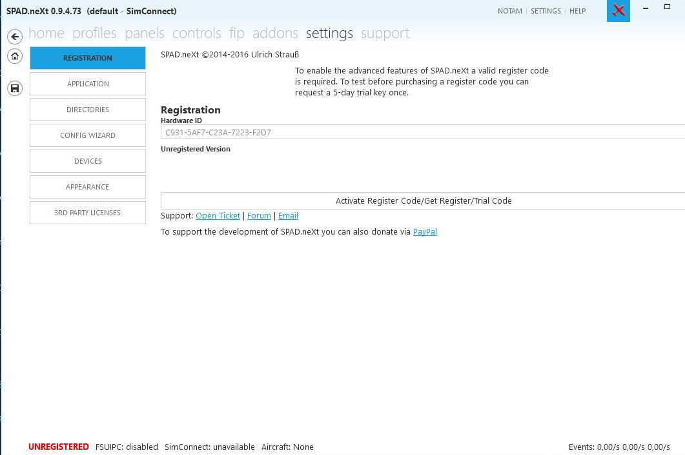

Fig. 30 The settings menu revised

We already dealt with the REGISTRATION submenu. So, let's go on to APPPLICATION, offering four submenus.

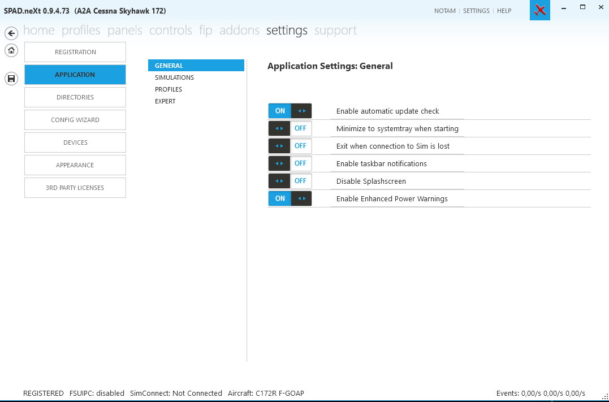

Fig. 31 Application Settings: General

Most of them are self-explanatory. As already mentioned, it's suggested to leave the automatic update check on. There is an active beta team, thus it's quite rare an error creeping into a release version. I'd suggest leaving taskbar notifications off, at least under Windows 8 or 10 - otherwise you'll have quite often that ugly Info Center from the right border popping in telling you something you don't want to know.

The last entry is a bit more cumbersome. It refers to the Windows USB port energy saving settings. These settings may cause devices to power down even at times when they shouldn't. If the switch is set to "ON" SPAD.neXt will detect this \(Windows default\) setting and produce a warning including instructions how to proceed. According to them, you should close SPAD.neXt once and restart it as an administrator which will modify those settings. Thus, it is suggested to leave this setting always "ON".

The next screen refers to various features required by certain profiles \(in other works, for certain types pf planes\) to work.

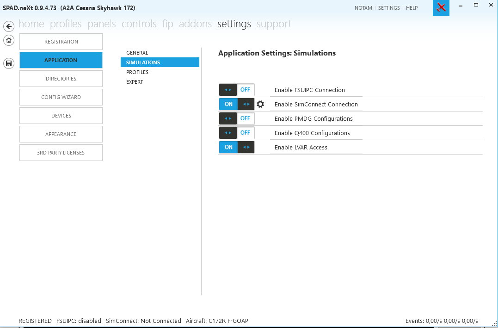

Fig. 32 Application Settings: Simulations

You can read off the requirements under "Provider" when importing online profiles. As already mentioned, A2A planes require LVAR support, and so on.

Registered only

All of these additional support features can only be enabled in the registered version.

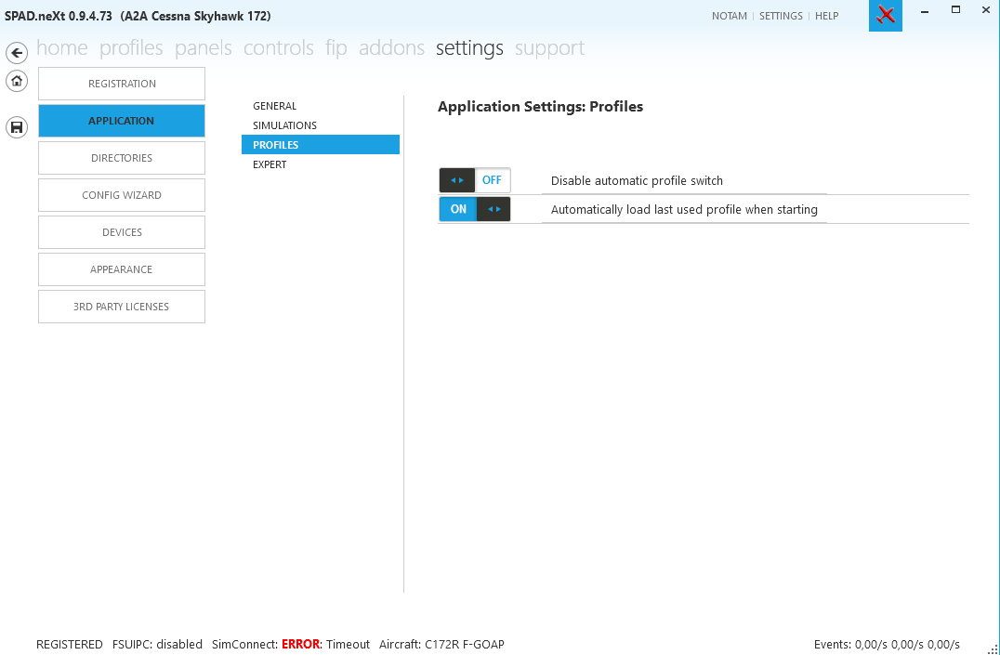

Fig. 33 Application Settings: Profiles

The 3rd submenu provides two settings for using the profiles. The first one is useful as soon as you gather quite a number of planes and corresponding profiles. SPAD.neXt will detect you assigned that "PMDG 777" to the Profile "My excellent 777 profile" and use it automatically as soon as you call the PMDG777 either at the start or while the simulator is running. If the switch is turned off, SPAD.neXt will not switch profiles automatically and just keep the currently loaded one, when switching aircraft in the simulation.

The last entry should be left as is as well. If you start SPAD.neXt before the simulator or just for maintenance purposes, it can't detect an active plane, thus it opts for the last active one - makes sense, doesn't it?

We will leave the Experts menu to the experts, skip DIRECTORIES to the left and switch to Config Wizard which provides an opportunity to repeat the Config Wizard we recall from Section 5, just in case you feel something went wrong. Most of the settings don't require the complete Wizard to be rerun as they can be changed via the Settings menu. Besides, this menu entry provides a possibility to enter the LVAR Bridge entry into you DLL.XML file, should it been missing \(e.g., in case you started with the freeware version and registered it later providing the possibility to use LVAR support\).

The DEVICES submenu gives a possibility to make some global \(i.e. profile independent\) settings for your devices. Most of them \(e.g. switching them on/off\) should be self-explanatory. As understood you can switch off support for devices you don't own.

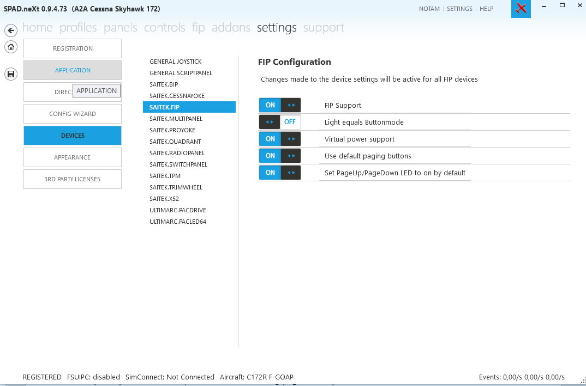

Fig. 34 Devices: Global FIPs Settings

The FIPs submenu has a few useful entries.

"Virtual power support": This will enable or disable the support for virtual power, to turn the FIP off based on conditions in the aircraft \(e.g. if the avionics switch is off\)-

This may be a matter of taste, but does the airspeed gauge in a real Cessna turn black as soon as the battery is switched off?

Besides, do you hate those unrealistically reed-glowing triangles below the SAITEK FIPs? The last option gives you an opportunity to turn off their LEDs altogether.

The submenu entry APPEARANCE allows you to adapt SPAD.neXt to your liking \(and environment, e.g. bright or dark\) and should be self-explanatory.

Don't forget to "Save Changes" after modifying any configuration setting.

## Working with profiles

After our rather sketchy treatment in Part A we will have a closer look upon working with profiles. We already described in Section 8 how to load an online profile, but there are more options.

Fig. 35 Once more on profiles

As you can see, the "A2A Cessna Skyhawk 172" we imported is listed under "LOCAL" now. According to the button selection on the r.h.s. you can do several manipulations with your local profiles.

Activating a profile might come handy, e.g., in case the simulator isn't running and you want to do some manipulations on the profile \(e.g. exchange FIPs or modify button settings\).

"New profile from this" creates a double of the active profile. Did you note the "A2A Cessna Skyhawk 172" on top still being assigned to "uncertifiedpilot"? This isn't you, is it? Thus, if you start adding or modifying stuff \(e.g. adding FIPs\), it's a better habit to make your personal copy like this:

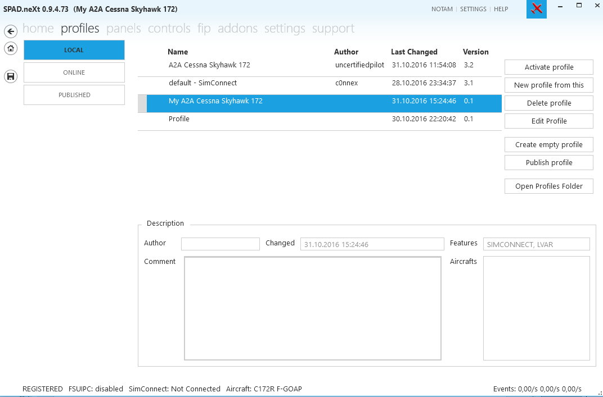

Fig. 36 Copying a profile

Moreover, this allows to provide your own comments \(use "Edit profile" for that purpose\). "Delete profile" and "Create empty profile" are self-explanatory. The last button leads you to the folder where your profiles are saved \(usually under _C:\Users\\(your profile\)\Documents\SPAD.neXt\Profiles_\). It is certainly a good idea to make a backup of this folder now and then, even more, if it contains your own valuable creations.

Where do all those Online profiles come from? Actually, they are published by users. Publishing your profiles can be done via the "Publish profile" button. It requires a forum account and, even more important, some background on programming your devices and thus is beyond just Getting Started.

## Once more on panels, controls, and fips - how to assign a button yourself

SPAD.neXt is a very powerful and highly flexible tool which allows pretty much any conceivable assignments to buttons, switches, or display functions. This, however, requires some knowledge not only of the assignment mechanisms but of SimConnect, LVAR variables etc. as well.

While a complete programmer's guide is way beyond this introduction \(and not required by the average user either\), we will show you at least two ways how to proceed in case you really want to add or modify functions. The following will be described taking a Saitek Cessna Yoke as an example, but application to other control devices should be more or less straightforward.

Registered only

This description will be given for modifying Controls settings, which most users might be interested in. Controls are only supported in the registered version. However, the general idea does also apply if you want to modify, e.g., a switch on the Saitek Switch Panel.

**14.1 Using Online-Snippets**

We start by activating our personal profile "My A2A Cessna Skyhawk 172". Next we change to the main controls menu entry and activate CESSNA YOKE.

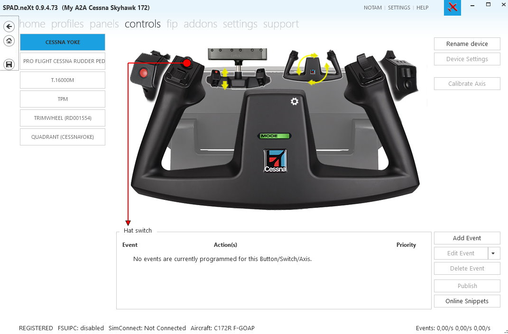

Fig. 37 : Controls: The Saitek Cessna Yoke

Clicking on the hat switch you will note there has been no action \(given in the pane below the yoke\) assigned to it. Thus, it does not sport the convenient function of looking around by tilting the hat switch.

Now we could start assigning these functions by hand, but there is a smarter method, called Online Snippets. Leave the hat switch active \(i.e. red line visible\) and press the Online Snippets button on the r.h.s.

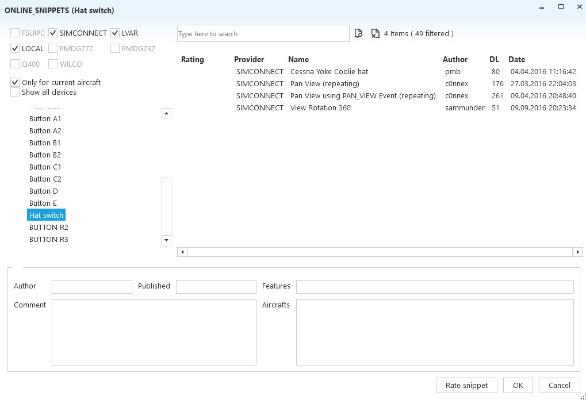

Fig. 38 Importing an Online Snippet

As you can see, there were 4 Online Snippets submitted for the coolie hat so far. In absence of any detailed description it is up to you to try which one you like best \(probably there is not much of a difference\). In this case the selection is easy: The first one "Cessna Yoke Coolie hat" was submitted by the author of this guide, thus I will give it preference. Put the blue bar onto it and press OK.

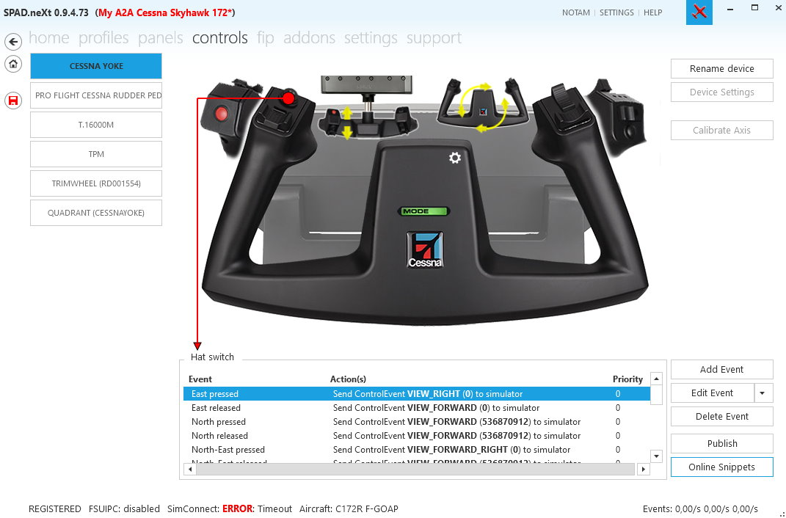

Fig. 39 Coolie hat functions have been assigned

You will note the functions of the several view directions in the pane below the graphics. Fortunately, you don't have to care about the entries at this point but just enjoy the functions.

Again, don't forget to "Save Changes" \(red disk icon\) after modifying the configuration.

**14.2 How to assign a function to a button**

This is probably at the borderline between Getting Started and Advanced, but I want to give anyone a hand being brave enough to try it himself or herself. After saving our present configuration, we are going to assign another useful function: It is often required to pause the simulator for whatever reason, thus we want to assign the Pause function to another button. Clicking through the various choices shows that the right rocker button \(the one in the North-South direction\) has not yet been assigned a function for its backwards movement.

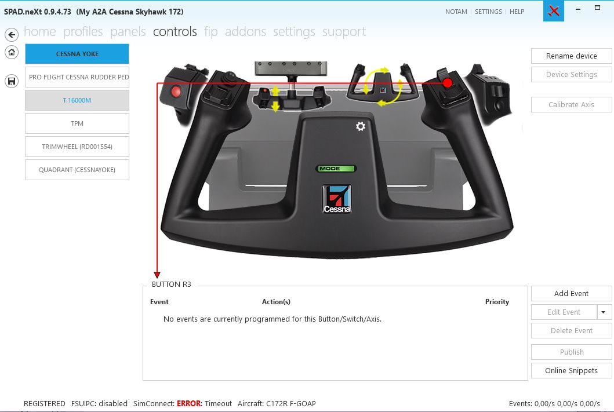

Fig. 40 The backwards movement of the r.h.s. N-S rocker switch is still unassigned

This will become our pause button. Press "Add Event" on the r.h.s. and select "Pressed \(Mode 1\)".

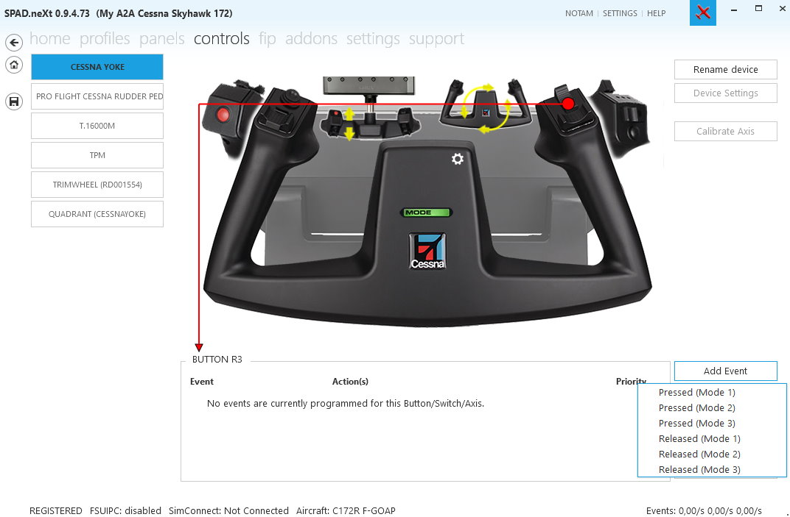

Fig. 41 Select Pressed \(Mode 1\)

Next you will be asked to "Add Action". Select "Send Simulation Event" here. You may note there are more interesting options like assigning a keyboard key to a button.

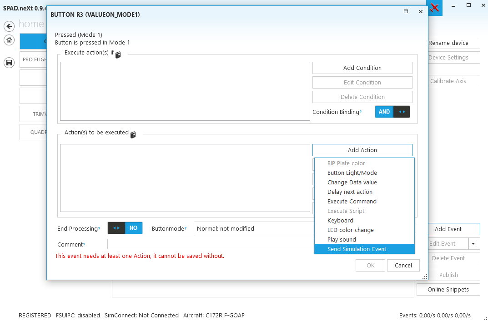

Fig. 42 Select Send Simulation Event

Now you are presented a long list of events to select from. Fortunately, there is a search function to input "pause". This will provide five results, where obviously the last one fits our intentions: Tilting the rocker switch backward once toggles pause on while the next tilting will switch it off.

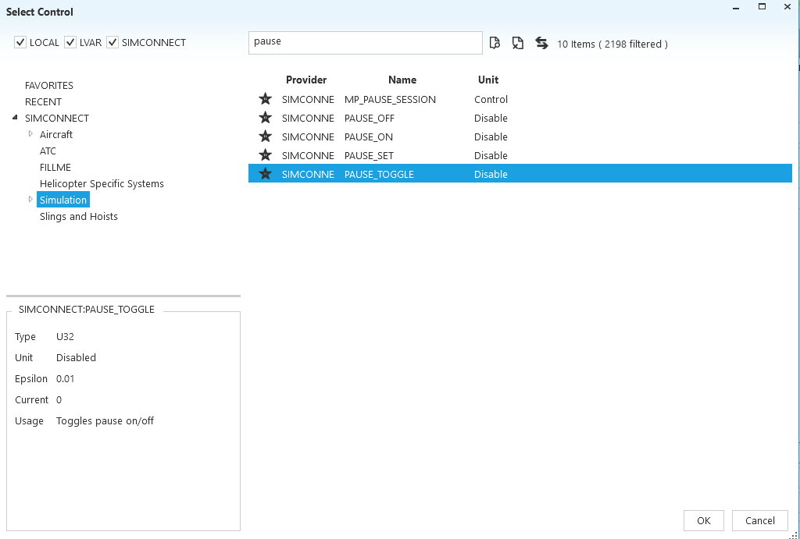

Fig. 43 Select PAUSE\_TOGGLE

After making your selection confirm "OK". Leave the next window "Define ControlEvent Action" as is and confirm another time "OK"

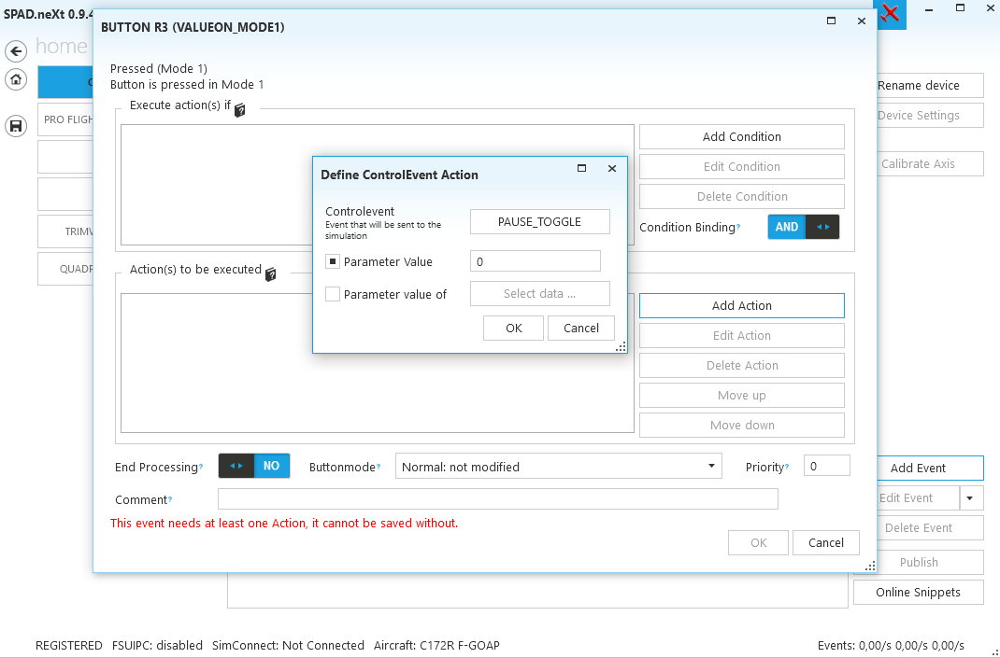

Fig. 44 Confirm the "Define ControlEvent Action" dialog as is with "OK".

This completes our assignments which should look like this:

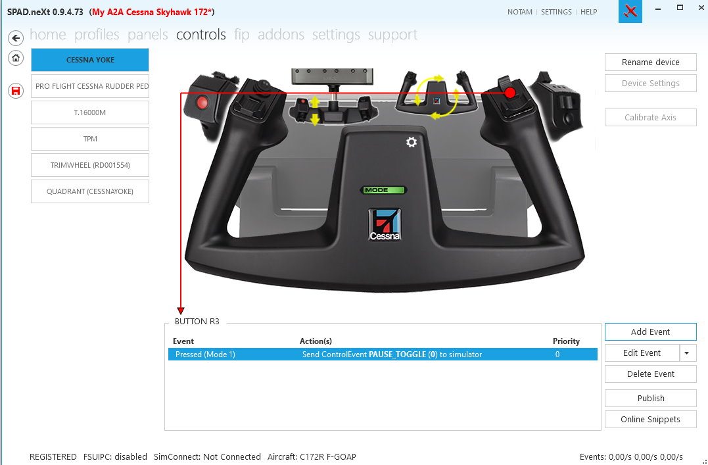

Fig. 45 Assignment done!

Again, don't forget to save your assignment and happy flying to try it!

## Gauges, gauges, gauges

We have seen in section 9 how to add a simple Saitek default gauge to a FIP. Granted, the One-for-all-style-Saitek panels work as such, but don't they look a bit, well, plain? Notably, if you own quite a number of those FIPs or even have them integrated into a bought or home-made panel, you may deserve something better.

Fortunately, SPAD.neXt supports a number of far more sophisticated and beautiful gauges, partially even developed in parallel with it. To access them for installation, recall how to assign a gauge to a Flight Instrument Panel \(cf. Fig. 24\). Instead of the last entry "SAITEK" we try the first one "ONLINE".

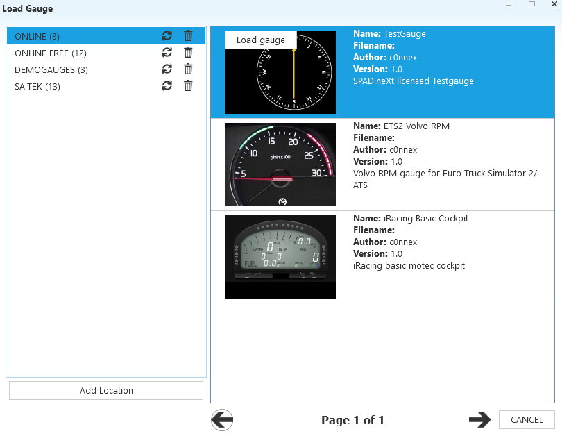

Fig. 46 The future gauge market

That's not yet impressive, but a preview for the future online gauge market where you will be able to buy gauges directly from within the program. The gauges in Fig. 41 indicate though, that SPAD.neXt is aimed to support much than just flight simulations.

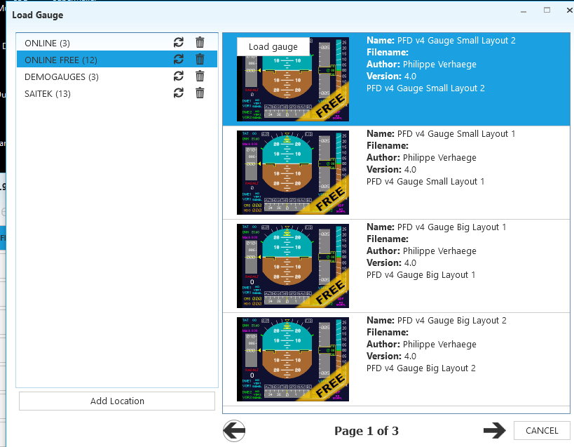

Fig. 47 Freeware gauges

The next entry provides a preview for a number of freeware gauges. You can download and install them, just by clicking onto them.

Finally, the 3rd entry showcases creations by two commercial providers providing their own gauge shops under [fipgauges](http://www.fipgauges.com/) and [FSXTimes](http://www.fsxtimes.tomandmiu.com/index.php), resp.

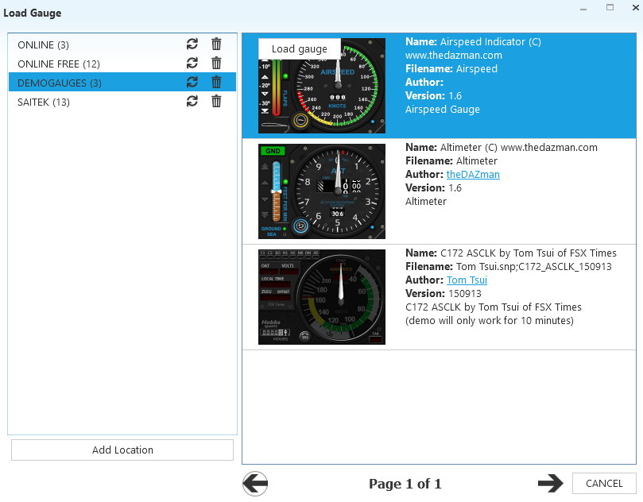

Fig. 48 Demo versions of payware gauges

You can install the demo gauges, the only limitation is they only will work for 15 minutes. Both providers' creations are two classes above the Saitek gauges and sport a number of additional functions like flaps display, time, and more, which the Saitek gauges lack. Having used their creations for years now, I will never return to the line-graphics style Saitek gauges.

Granted these professional-grade gauges are not "cheap" if you are going to buy a larger number of them, but they are worth every cent. Moreover, look for bundles if you buy several of them.

Installation of any addon gauges is trivial: Just make a new folder under the "Gauges" in _C:\Users\\(your profile\)\Documents\SPAD.neXt\Gauges_, place them there and the next time SPAD.neXt will be started they will be found.

## SimConnect and networked configurations

As already mentioned in several places, SPAD.neXt makes use of the SimConnect interface developed by Microsoft and now by Lockheed Martin.

SPAD.neXt presupposes a working SimConnect interface in any case, independent on if it runs on the same computer as your simulator or networked on a Client.

**15.1 SimConnect installation on the Flightsim PC**

To begin with: SimConnect installation is a bit tricky and can even be a hassle. The following is a guideline to get you started. We will refer to some further reading at the end of this Section.

Before going to install SimConnect it is advised to check if it is already installed on your flightsim machine. This is highly probable as a lot of programs like Active Sky, FSGlobal Real Weather, Plan-G, or others use it. Check under

_C:\Windows\WinSxS_

If there are any SimConnect versions available you are done \(in case there are several of them, do NOT uninstall them\). Skip all further steps in Section 15.1 in case you already have a working SimConnect connection!

If this is not the case you have to install SimConnect. FSX:SE and Prepar3D have SimConnect installed by default, while you have to install it yourself for FSX \(boxed\). A detailed guide can be found under

[http://fsdeveloper.com/wiki/index.php?title=SDK\_Installation\_\(FSX\)](http://fsdeveloper.com/wiki/index.php?title=SDK_Installation_%28FSX%29)

Next, you have to configure SimConnect. Look for a file "SimConnect.xml" under the simulator's configuration directory, either, for FSX,

_C:\Users\\(your profile\)\AppData\Roaming\Microsoft\FSX_

or, for Prepar3D3,

_C:\Users\\(your profile\)\AppData\Roaming\Lockheed Martin\Prepar3D v3._

_This might look as follows:_

&lt;?xml version="1.0" encoding="Windows-1252"?&gt;

&lt;SimBase.Document Type="SimConnect" version="1,0"&gt;

&lt;Descr&gt;SimConnect&lt;/Descr&gt;

&lt;Filename&gt;SimConnect.xml&lt;/Filename&gt;

&lt;SimConnect.Comm&gt;

&lt;Disabled&gt;False&lt;/Disabled&gt;

&lt;Protocol&gt;IPv4&lt;/Protocol&gt;

&lt;Scope&gt;global&lt;/Scope&gt;

&lt;Address&gt;192.168.2.110&lt;/Address&gt;

&lt;MaxClients&gt;64&lt;/MaxClients&gt;

&lt;Port&gt;4506&lt;/Port&gt;

&lt;MaxRecvSize&gt;4096&lt;/MaxRecvSize&gt;

&lt;DisableNagle&gt;False&lt;/DisableNagle&gt;

&lt;/SimConnect.Comm&gt;

&lt;SimConnect.Comm&gt;

&lt;Disabled&gt;False&lt;/Disabled&gt;

&lt;Protocol&gt;Auto&lt;/Protocol&gt;

&lt;Scope&gt;local&lt;/Scope&gt;

&lt;/SimConnect.Comm&gt;

&lt;/SimBase.Document&gt;

Actually, there may be further entries, and they may look different. If this file is missing, create it using notepad and save it into the appropriate directory. Important entries are the "Address" and "Port" setting. "Address" is the IP address of your Flightsim computer. You can read it off using, e.g., the command line utility "ipconfig" to be started on a Command Shell, as "IPv4 Address".

In case you intend to work in a networked configuration, it is highly advised to allocate a fixed IP address to the Server; otherwise \(when relying on the DHCP protocol in your router\) you would have to modify configuration files every time you reboot your machines. This can be done as follows: Open the Control Panel, select "Network and Sharing Center". In the menu on the l.h.s. select "Change adapter settings". Right-click on "LAN Connection" \(or another connection you use\) and "Properties". Now scroll to "Internet Protocol Version 4". Next, go to "Properties" and switch from "Obtain an IP address automatically" to "Use the following IP address". Select an address within the range of 192.168.2.000 to 192.168.2.100. In case of a networked configuration do the same \(albeit with another IP number\) on the Client machine.

If you have more machines \(including, maybe, printers\) connected make sure addresses don't match to theirs.

For the Port setting start with 4506, however, this may require some experimenting in case the port is already in use by some other program.

Excellent descriptions on how to configure SimConnect can be found in the following manuals:

Plan-G: [http://www.tasoftware.co.uk/plan-g/files/Plan\_G%20Manual.pdf](http://www.tasoftware.co.uk/plan-g/files/Plan_G%20Manual.pdf)

SimLauncherX: [http://www.avsim.com/topic/453567-simlauncherx-the-freeware-tool-everyone-has-been-waiting-for/](http://www.avsim.com/topic/453567-simlauncherx-the-freeware-tool-everyone-has-been-waiting-for/) \(Manual installed with the Software\)

**15.2 Installing SPAD.neXt on a networked machine**

In my eyes, one of the biggest advantages of SPAD.neXt is its ability to support a networked configuration. I have observed this to free quite an amount of resources on the flightsim machine, notably if you run a higher number of FIPs. In what follows the machine running the simulator will be called the Server, while an optional networked machine will be named a Client.

When installing SPAD.neXt on a Client, select the lower checkbox in the opening window of the Configuration Wizard \(Fig. 38 cf. the former Fig. 1\).

Fig. 49 The Configuration Wizard initial screen

In the following windows disable FSUIPC and skip to the SimConnect selection Window. Fill in the corresponding figures you selected either under Section 15.1 or had already preconfigured and can read off from your "SimConnect.xml" file.

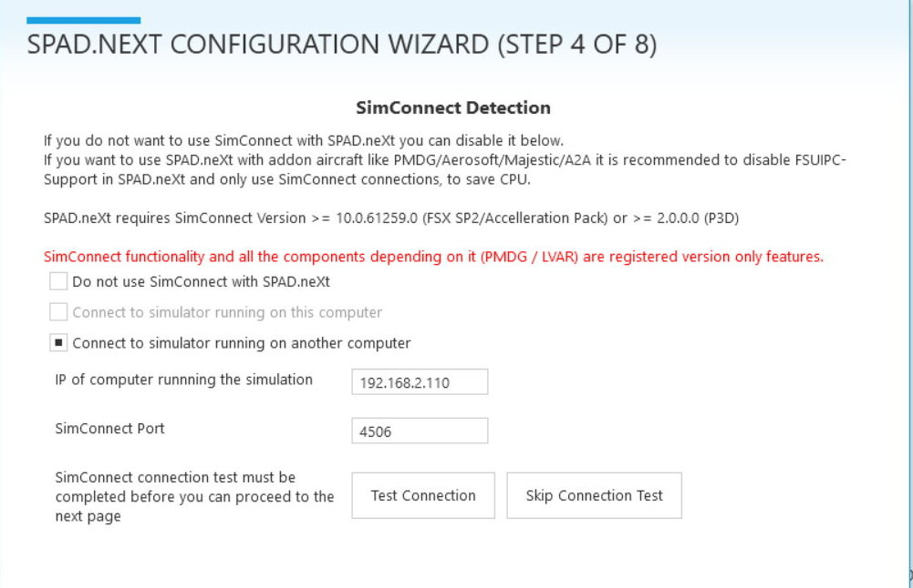

Fig. 50 Fill in the details from your "SimConnect.xml" file

Given the numerous potential error sources and continuous complains in forums, testing the connection should be a MUST in case of a networked configuration.

If all goes well the result should look as follows:

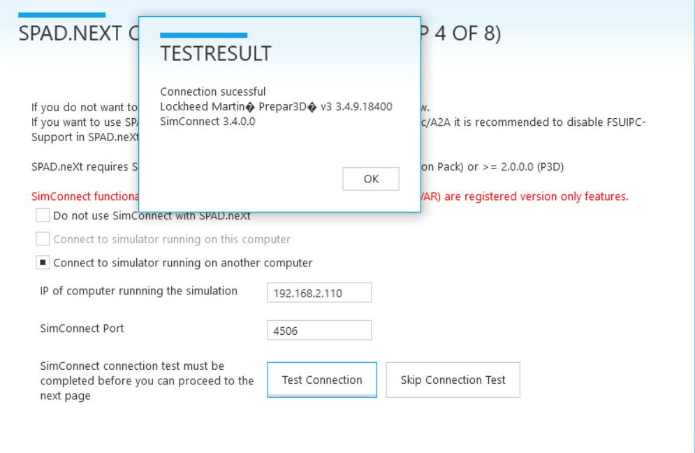

Fig. 51 SimConnect connection test passed

Now you can proceed as in Section 5. There is one more loophole, though. In case you will need LVAR support, e.g., for an A2A plane, SPAD.neXt needs "SPDbridge.dll" to run on the Server machine which the installer does not have access to. Thus, you have to include it into dll.xml yourself.

Registered only

Keep in mind LVAR support requires the registered version.

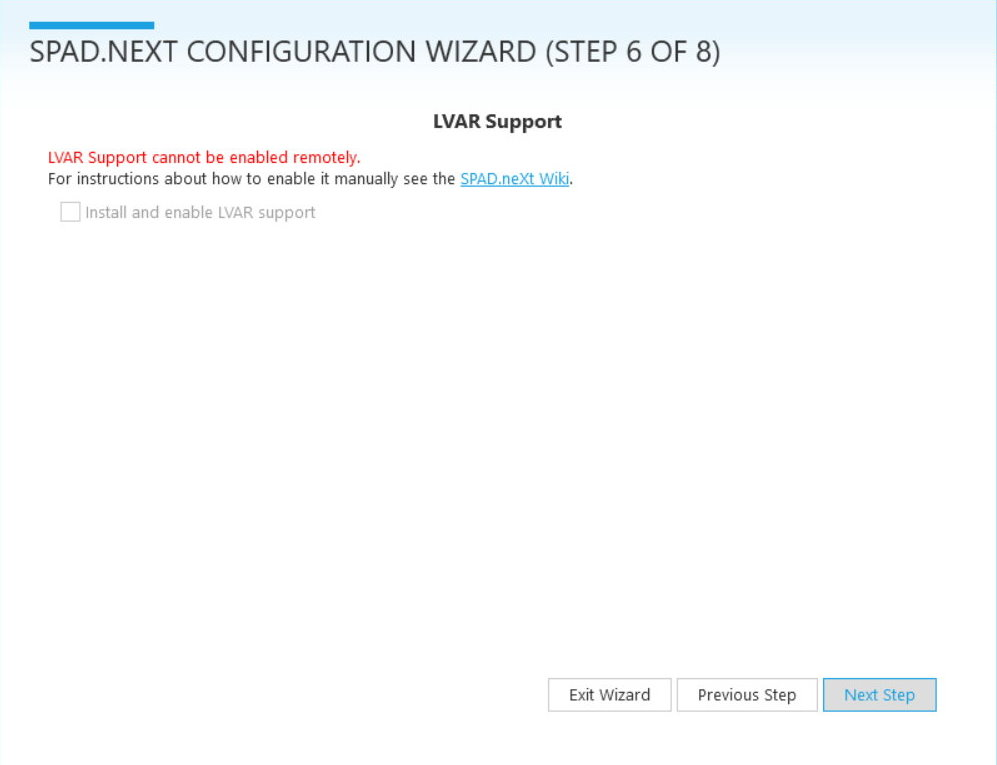

Fig. 52 You have to install the SPAD.neXt bridge manually on the Server

The procedure is simple and described in the [link](https://www.fsgs.com/wiki/lvar_support_installation) given in Fig. 40. Essentially, you have to copy the file "_SPDBridge.dll"_ from the Client to the Server, e.g. to "Simulator maindirectory\Modules", plus add a corresponding dll.xml entry pointing to it.

After these steps, you can complete the Configuration Wizard as in Section 5.

While SPAD.neXt is running, the SimConnect status can always be watched on the Status Line at the bottom. Needless to say, don't forget to plug your panels/controls/FIPs or whatever into an USB port of your Client in this case. Again, you can start SPAD.neXt on the Client before, with or after the simulator.

Attention

In a networked configuration, there is no aircraft selection for the profile like in Fig. 17 and 18. Instead, the following box will pop up after starting the simulator:

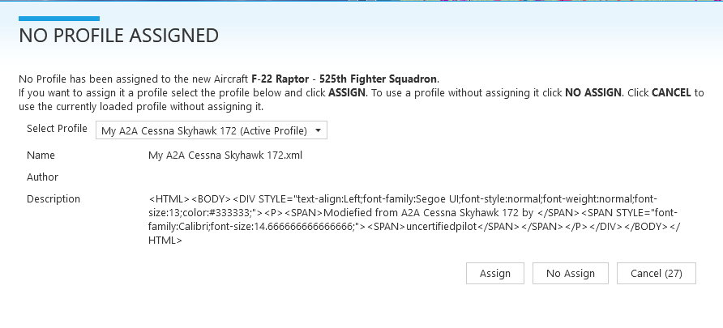

Fig. 53 The no profile assigned box

This allows you to select a proper profile among the installed ones. This should happen only once, though, as SPAD.neXt will recall your choice for later.

## Where can I get further help?

There certainly will be issues. Either, the user can fail, or the program can fail, or this guide can fail. There are several possibilities to look for help.

**Passive forum search**

Usually someone else had a similar issue before. You can navigate to the forum [https://www.spadnext.com/forum/](https://www.spadnext.com/forum/) and use the search function. I did this numerous times and did quite often find a suggestion or even solution.

**Ask at the forum**

It your search is without any useful result, you can place your own question in the forum. Posting requires establishing a forum account first. Please, use the following guidelines for reporting an issue:

1. Attach a logfile \( SPAD.log from %APPDATA%\SPAD.neXt\logs\) \[Zip if &gt;300 Kb or multiple files\]
2. Attach the profile used or name the default profile if the problem is profile specific
3. Describe your problem as exact as possible. Maybe attach screenshots

Refrain from hijacking other peoples' threads, until you have exactly the same problem.

**Open a ticket on the website**

You can navigate to the website [http://www.spadnext.com/support/](http://www.spadnext.com/support/) and open a ticket there. \(This link is also in the red bar on top of the forum!\) Choose the OPEN A NEW TICKET tab and proceed according to the guidance. You can check the status of your ticket in the same place as well.

To login to the support system, use your Forum credentials \(username / password \)

**Open a ticket from within SPAD.neXt \(recommended\)**

SPAD.neXt itself includes an interface to the ticket system allowing to report issues. To access it, navigate to the "support" main menu entry and select "Create new ticket" on the r.h.s. This opens an editor window to report your issue. It is highly suggested to add the files at the bottom \(as applicable\). You can check the status of your ticket from within SPAD.neXt as well.

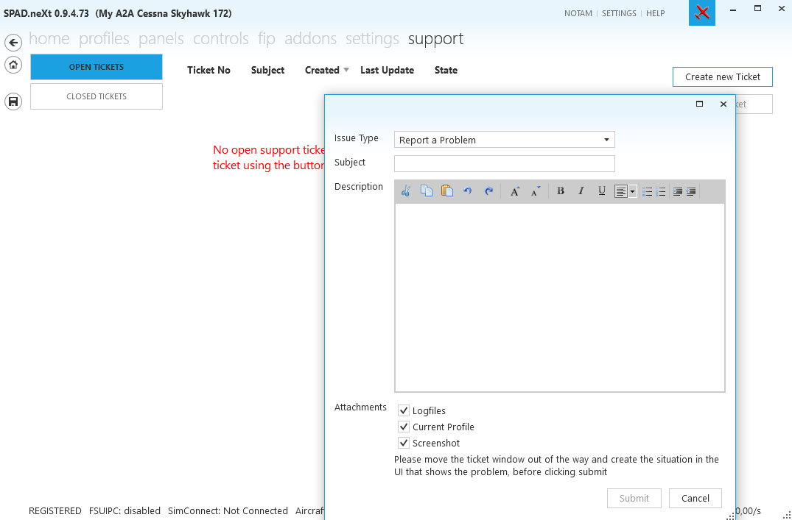

_Fig. 50: Sending a support ticket_

## Author and Version

This is Getting Started \(formerly Quickstart\) Version 0.5 written by Michael Basler \([http://michael-basler.net](http://michael-basler.net/)\). It is valid for SPAD.neXt, Version 0.9.4.73, by Ulrich Strauß \([http://fsgs.com/](http://fsgs.com/)\).

**Changelog**

06/24/2015 Initial release \[MB\]

06/25/2015 Graphical improvements, added UAC hint, several improvements throughout \[US\]

06/29/2015 Start via FSUIPC.ini, changelog added \[MB\]

06/30/2015 Reformatting \[US\]

07/06/2015 Added paragraph on General Configuration Settings \[MB\]

07/31/2015 Added section 4 Unregistered vs. registered version \[MB\]

09/15/2015 Updated all Sections for 0.6.5735, added material on registered version and registering, added Section on SimConnect \[MB\]

10/18/2015 Adapted to Version 7, Configurations Wizard Section added, new Version 7 Figures, Minor corrections \[MB\]

10/31/2016 Completely rewritten and extended version reflecting new features like FIPs support, Online Profiles, Code Snippets, Ticketing system, and much more. Renamed Getting Started. \[MB\]

Fig. 1 License agreement 8

Fig. 2 Install Location 9

Fig. 3 Downloading installation files 10

Fig. 4 Installation completed 10

Fig. 5 Configuration Wizard: Welcome screen 12

Fig. 6 Configuration Wizard: Simulator detection. 13

Fig. 7 Configuration Wizard: FSUIPC Detection 14

Fig. 8 Configuration Wizard: SimConnect Detection 15

Fig. 9 Configuration Wizard: PMDG 737 NGX/777X Detection 16

Fig. 10 Configuration Wizard: LVAR Support 17

Fig. 11 Configuration Wizard: Overview 18

Fig. 12 Configuration Wizard: Final Step 18

Fig. 13 The main interface: home 19

Fig. 14 The registration submenu 21

Fig. 15 Buying / Activation / Trial 21

Fig. 16 Buying / Activation / Trial request 22

Fig. 17 The profiles menu 23

Fig. 18 Online profiles selection 24

Fig. 19 The added A2A Cessna profile in the profiles list 25

Fig. 20 Enabling/disabling features under Applications Settings 26

Fig. 21 Editing a profile 27

Fig. 22 Assigning an aircraft to a profile 27

Fig. 23 Assignment of the A2A C172 to the profile "A2A Cessna Skyhawk 172" 28

Fig. 24 The interface for the Saitek Multi Panel 29

Fig. 25 The interface for the Saitek Cessna Yoke 30

Fig. 26 One of the Saitek Flight Instrument Panels 30

Fig. 27 Main gauge selection 31

Fig. 28 Gauge selection 32

Fig. 29 FIP selection completed - the Saitek Airspeed gauge 32

Fig. 30 The settings menu revised 38

Fig. 31 Application Settings: General 38

Fig. 32 Application Settings: Simulations 39

Fig. 33 Application Settings: Profiles 40

Fig. 34 Devices: Global FIPs Settings 41

Fig. 35 Once more on profiles 42

Fig. 36 Copying a profile 43

Fig. 37 : Controls: The Saitek Cessna Yoke 44

Fig. 38 Importing an Online Snippet 45

Fig. 39 Coolie hat functions have been assigned 45

Fig. 40 The backwards movement of the r.h.s. N-S rocker switch is still unassigned 46

Fig. 41 Select Pressed \(Mode 1\) 47

Fig. 42 Select Send Simulation Event 47

Fig. 43 Select PAUSE\_TOGGLE 48

Fig. 44 Confirm the "Define ControlEvent Action" dialog as is with "OK". 48

Fig. 45 Assignment done! 49

Fig. 46 The future gauge market 50

Fig. 47 Freeware gauges 51

Fig. 48 Demo versions of payware gauges 51

Fig. 49 The Configuration Wizard initial screen 55

Fig. 50 Fill in the details from your "SimConnect.xml" file 55

Fig. 51 SimConnect connection test passed 56

Fig. 52 You have to install the SPAD.neXt bridge manually on the Server 57

Fig. 53 The no profile assigned box 57

