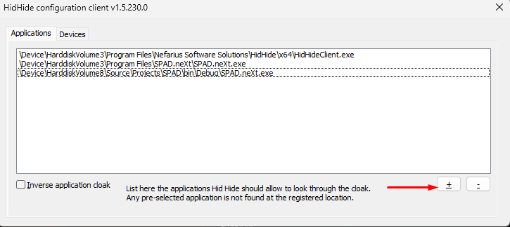
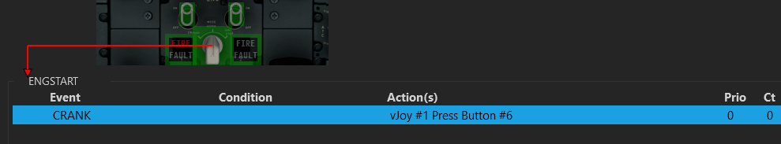

# Other Simulations

Basically you can drive any software using SPAD.neXt.\
While a common way to control those software (e.g. Star Citizen) is using Keyboard events,  this has some limitations due to windows security.

If the target software supports joysticks, you receive the best experience by follwing this steps:

* Install vJoy [https://github.com/jshafer817/vJoy/releases](https://github.com/jshafer817/vJoy/releases)
  * This will create a virtual joystick which you can control from within SPAD.neXt
  * Configure one or more virtual Joysticks to your likings
* Install HidHide [https://github.com/nefarius/HidHide/releases](https://github.com/nefarius/HidHide/releases)
  * This software allows you to hide specific joystick devices to the system making it easier to bind functions.
  * Configure HidHide to hide all devices that you want to drive by SPAD.neXt
  * Configure HidHide to expose those devices to SPAD.neXt by adding the SPAD.neXt executable (C:\Program Files\SPAD.neXt\SPAD.neXt.exe usually) to the Applications tab

<figure><figcaption></figcaption></figure>

*   Configure your devices in SPAD.neXt to forward buttons/axis to vJoy&#x20;

    * Example&#x20;

    <figure><figcaption></figcaption></figure>
* In the target software now bind the vJoy buttons/axis by pressing the button/moving the axis on the device
