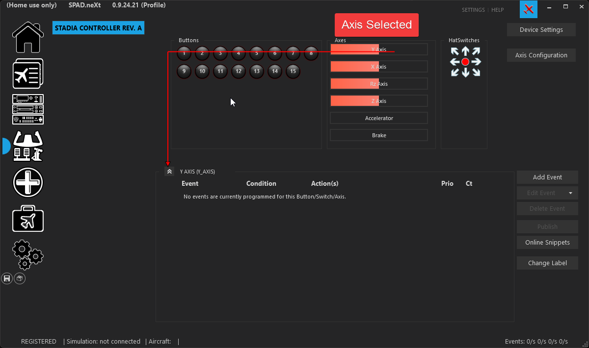

# Basic Flight Controls – Axis Setup

Now it’s time to tackle the real beasts of the flight deck—**your flight control axes.**\
Because if your yoke is limp, your rudder’s confused, and your throttle’s spiky… you're flying a flying brick with cool lights.

#### ✈️ What Is an Axis?

Think of axes (plural of axis, not something you swing at your PC) as the analog controls—smooth, continuous inputs like:

* Yoke pitch & roll (your classic “push and pull” and “left and right”)
* Rudder pedals (tail wagging)
* Throttle(s) (moar power!)
* Mixture, Prop pitch, toe brakes, spoilers, flaps, coffee temperature knobs (okay maybe not that last one… yet)

If it moves smoothly and _isn’t_ a button, it’s probably an axis.

### X-plane Default Axes + Datarefs + Value Ranges

<table data-header-hidden><thead><tr><th width="154"></th><th width="189"></th><th width="180"></th><th valign="top"></th></tr></thead><tbody><tr><td><strong>Axis Role</strong></td><td><strong>What It Controls</strong></td><td><strong>Default DataRef</strong></td><td valign="top"><strong>Value Range</strong></td></tr><tr><td><code>Pitch</code></td><td>Elevator (yoke push/pull)</td><td><code>sim/joystick/yoke_pitch_ratio</code></td><td valign="top"><code>-1.0</code> (nose down) to <code>1.0</code> (nose up)</td></tr><tr><td><code>Roll</code></td><td>Ailerons (yoke left/right)</td><td><code>sim/joystick/yoke_roll_ratio</code></td><td valign="top"><code>-1.0</code> (left) to <code>1.0</code> (right)</td></tr><tr><td><code>Yaw</code></td><td>Rudder (pedals or stick twist)</td><td><code>sim/joystick/yoke_heading_ratio</code></td><td valign="top"><code>-1.0</code> (left) to <code>1.0</code> (right)</td></tr><tr><td><code>Throttle 1</code></td><td>Engine power (engine 1)</td><td><code>sim/flightmodel/engine/ENGN_thro[0]</code></td><td valign="top"><code>0.0</code> (idle) to <code>1.0</code> (full power)</td></tr><tr><td><code>Throttle 2</code></td><td>Throttle (engine 2)</td><td><code>sim/flightmodel/engine/ENGN_thro[1]</code></td><td valign="top"><code>0.0</code> to <code>1.0</code></td></tr><tr><td><code>Throttle 3</code>, <code>4</code></td><td>More throttles</td><td><code>ENGN_thro[2]</code>, <code>[3]</code></td><td valign="top"><code>0.0</code> to <code>1.0</code></td></tr><tr><td><code>Prop 1</code></td><td>Prop RPM (engine 1)</td><td><code>sim/flightmodel/engine/ENGN_prop[0]</code></td><td valign="top"><code>0.0</code> (low RPM) to <code>1.0</code> (high RPM)</td></tr><tr><td><code>Prop 2</code></td><td>Prop RPM (engine 2)</td><td><code>ENGN_prop[1]</code></td><td valign="top"><code>0.0</code> to <code>1.0</code></td></tr><tr><td><code>Mixture 1</code></td><td>Fuel/air mix (engine 1)</td><td><code>sim/flightmodel/engine/ENGN_mixt[0]</code></td><td valign="top"><code>0.0</code> (cutoff) to <code>1.0</code> (full rich)</td></tr><tr><td><code>Mixture 2</code></td><td>Mixture (engine 2)</td><td><code>ENGN_mixt[1]</code></td><td valign="top"><code>0.0</code> to <code>1.0</code></td></tr><tr><td><code>Speedbrake</code></td><td>Spoilers / airbrakes</td><td><code>sim/flightmodel/controls/speedbrake_ratio</code></td><td valign="top"><code>0.0</code> (retracted) to <code>1.0</code> (full out)</td></tr><tr><td><code>Flaps</code></td><td>Flap lever</td><td><code>sim/flightmodel/controls/flap_ratio</code></td><td valign="top"><code>0.0</code> (up) to <code>1.0</code> (full flaps)</td></tr><tr><td><code>Reverse Thrust</code></td><td>Reversers active (per engine)</td><td><code>sim/flightmodel/engine/ENGN_thro_use_rev</code></td><td valign="top"><code>0</code> (off) or <code>1</code> (on)</td></tr><tr><td><code>Brakes</code></td><td>Main brakes (left/right combined or split)</td><td><code>sim/flightmodel/controls/parkbrake</code> or <code>l_brake_add</code> / <code>r_brake_add</code></td><td valign="top"><code>0.0</code> (released) to <code>1.0</code> (full brake)</td></tr><tr><td><code>Nosewheel Steering</code></td><td>Nose gear steering</td><td><code>sim/flightmodel/controls/nwheel_steer</code></td><td valign="top"><code>-1.0</code> (left) to <code>1.0</code> (right)</td></tr><tr><td><code>Landing Gear</code></td><td>Gear handle (if used as axis)</td><td><code>sim/flightmodel/controls/gear_handle_down</code></td><td valign="top"><code>0</code> (up) or <code>1</code> (down)</td></tr></tbody></table>

### 🎮 Step 1: Axis Configuration

**(Or: Teaching Your Controls Which Way Is Up)**

Alright, time to get your hands on the flight controls—literally.

Head over to the **left panel in SPAD.neXt** and select the device you want to configure. This could be your yoke, throttle quadrant, rudder pedals, or that mysterious lever you _swear_ you’ll use one day.

Now click into the **Axis section**.

If it moves, wiggles, slides, or generally refuses to stay still—it’ll show up here. Think of this as your aircraft’s roll call. 

#### 🕹️ Identify Your Axis

Now give your control a wiggle—nice and easy, no need to wrestle it like a crosswind landing.

SPAD.neXt will highlight the axis that’s moving. Once you’ve found the right one, **click it to select it**.

> 🎯 _“Ah yes… Axis 2. The chosen one.”_

<figure><figcaption></figcaption></figure>

* ➕ Create the Event\
  Click “Add Event”\
  Select “Axis Value Changed”\
  \
  This tells SPAD.neXt:\
  🛫 “Oi, every time this thing moves—pay attention!”\
  \
  Next:\
  \
  Click the ➕ (plus) icon\
  Select “Custom Axis Event”

<figure><figcaption></figcaption></figure>

***

#### ✈️ Let’s Configure Pitch (Elevator)

For this example, we’re wiring up the **Pitch axis**—the one that decides whether you climb majestically… or inspect the runway at high speed.\
At first glance, it might look like the flight computer from a space shuttle. Don’t panic—we’ll break it down.\
🧠 What All This Means (Without the Headache)

<figure><figcaption></figcaption></figure>

1. 🎚️ **Axis Current RAW Value**\
   This is your raw input—the unfiltered, straight-from-the-hardware signal.\
   Think of it as your control saying:\
   🗣️ _“I’m moving! I just don’t know what it means yet!”_
2.  **Range Definition** ,Ignore this for now. Seriously. Taxi right past it.

    It’s for more advanced setups—like when you start building logic that would make real avionics engineers.\
    🔄 **Rescale Value → YES**\
    This tells SPAD.neXt to translate your hardware input into something X-Plane actually understands.

    Because your joystick might speak “random USB nonsense,”\
    but X-Plane speaks **nice, clean aviation numbers**. 

    **📏 Understanding Axis Ranges**

    Not all axes are created equal:

    * ✈️ **Pitch / Roll / Yaw (centered axes):**\
      Range = `-1` to `+1`
      * `0` = centered
      * Negative = one direction
      * Positive = the other
    * 🛫 **Throttle / Prop / Mixture (non-centered axes):**\
      Range = `0` to `1`
      * `0` = idle/off
      * `1` = full send

    > 🧠 _Refer back to your Axis Table if your brain starts buffering._
3.  🎯 **Target (The Important Bit)**\
    This is where you tell SPAD.neXt what you actually want to control.

    For **Pitch**, use: sim/cockpit2/controls/yoke\_pitch\_ratio\
    That’s the elevator control—the thing keeping you from becoming a lawn dart.
4.  **📥 Use Axis Value**

    Select this option—this tells SPAD.neXt:

    👉 “Take whatever the axis is doing… and use it.”
5.

    #### ✅ Final Approach

    Click **OK**.

    And just like that—your **Pitch (Elevator) axis is configured**.

    Give it a test in-sim:

    * Pull back → nose goes up ✅
    * Push forward → nose goes down ✅
    * No screaming or confusion → perfect ✅

🔁 Rinse and Repeat

You can now repeat this process for:

* Roll
* Yaw
* Throttle
* Prop
* Mixture
* And anything else that slides, spins, or behaves suspiciously like an axis

Just use your **Axis Table** as your flight manual for picking the correct datarefs and value ranges. 
