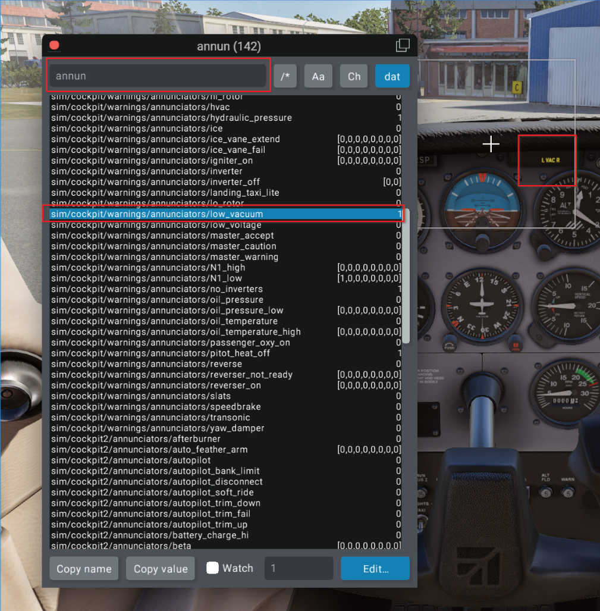

# Dataref Tool

Now that we’ve taxied past the basics, it’s time to install the DataRef Tool—your new\
best friend when it comes to connecting SPAD.neXt with the deep inner workings of\
X-Plane. Think of it as your aircraft’s diagnostic scanner, letting you peek behind the\
curtain and see exactly what’s going on with all those mysterious datarefs.

**🧭 Step 1: Download the DataRef Tool**\
You can grab the latest version from a trusted X-Plane community site like the X-Plane.org forums. Just search for “DataRefTool” or “DataRef Editor” (note: not the same as DataRef Viewer, but they can work together). Make sure it’s compatible with your version of X-Plane.\
\
[https://datareftool.com/](https://datareftool.com/)

<figure><figcaption>
Datareftool Homepage
</figcaption></figure>

**📁 Step 2: Unzip and Install**\
Once downloaded, unzip the folder. Inside you’ll find a plugin folder—usually named something like DataRefTool with the version number. Note the latest version is **NOT compatible with Xplane 11**\
Drag and drop that folder into your X-Plane > Resources > plugins directory. That’s it! No complicated installer, no bloat—just good old-fashioned drag-and-drop.

<figure><figcaption>
Inside Datareftool Zip
</figcaption></figure>

<figure><figcaption>
X-Plane Plugins Folder
</figcaption></figure>

**🛫 Step 3: Fire Up X-Plane**\
Launch X-Plane, load into any aircraft (even the default Cessna if you're just testing things out), and then check the Plugins menu at the top. You should see DataRef Tool listed there, ready for duty.

<figure><figcaption>
Datareftool Inside Xplane
</figcaption></figure>

**🔍 Step 4: Verify It's Working**\
Click on the plugin, and a search window should pop up. From here, you can start typing in keywords (like lights, battery, gear, etc.) to see live values and interact with them in real time. If you’re seeing live data and clickable checkboxes, congrats—you’re in business!

<figure><figcaption>
Testing Datareftool
</figcaption></figure>

**🧩 Bonus Tip:**\
Assign 1 button within X-plane to write the the drt\_last\_run\_commandrefs.txt &\
drt\_last\_run\_datarefs.txt files this will save you a lot of time. This will overwrite the existing files whilst in the simulator & Instead of rebooting the sim you can make your edits and reboot Spad.Next. 

<figure><figcaption>
Assigning A Button
</figcaption></figure>

Pressing this button will then write 2 files to the following location.\
&#x20;                                                         \X-Plane 12\Output\preferences

<figure><figcaption>
Datareftool Files
</figcaption></figure>

