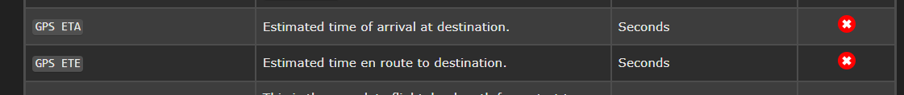

# UI Familiarization

When SPAD.neXt Launches and after initialization you are greeted with the following Home Page as seen in Fig 1&#x20;

.png>)Fig 1

The UI Contains Navigational Elements On the Left Hand side.  In addition there are two "quick selects" found in the Upper right side to Jump to the Settings and Support sections of the program. Seen in Fig 2 with the red arrow pointing to the location

Fig 2

The Left Most Column of the User Interface is the Navigation Column.  The Navigation Column is always visible while the second column to the right is the sub navigation or "Tabs" for the UI component that this selected in the Navigation Column.   Fig 3 points to these elements

.png>)Fig 3

The SPAD.neXt Version in operation can be found at the Top of the UI on the Left Side.  If running on an Alpha or Beta channel (selectable in Settings) that will also be displayed as seen in Fig 4.  Next to the version number the current "Profile" is displayed in brackets.

&#x20;.png>)Fig 4

The Lower Left will display text regarding the current state of connection to the simulator and even what version you are on.  Side note if something happens to your license (like say you upgrade your network card to a 2.5Gb) and it is reset this will be a good indication as it will revert from a Registered License to a Trial and easy to find here.  The Simulation connected and even aircraft loaded will also appear here at the bottom as seen in Fig 5

.png>)Fig 5

The Lower Right is displaying the events traffic that SPAD.neXt is Interacting with the simulation as seen in Fig 6.

.png>)Fig 6

